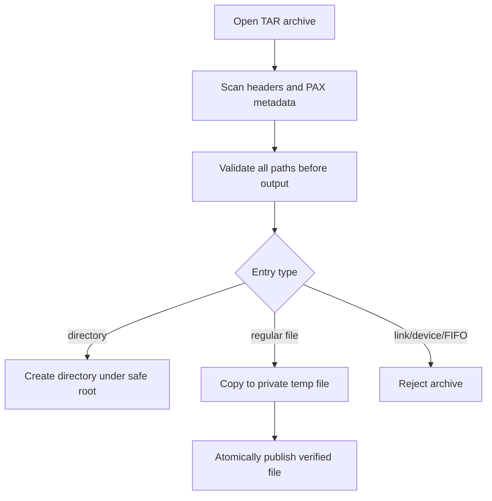

# Archive Format Support And Research

Research checked on 2026-06-16.

SuperZip is first a native AMD HIP `.suzip` application. Compatibility formats
must not change that boundary. A compatibility format is accepted only when it
has a direct in-process parser/writer path, clear resource limits, and the same
pre-write path validation used by SUZIP.

## Sources

Primary and project-owned sources reviewed:

- 7-Zip: https://www.7-zip.org/
- WinRAR: https://www.win-rar.com/
- WinZip format guide: https://www.winzip.com/en/learn/file-formats/
- PeaZip: https://peazip.github.io/
- Bandizip: https://en.bandisoft.com/bandizip/
- Keka: https://www.keka.io/en/
- The Unarchiver: https://theunarchiver.com/
- libarchive: https://www.libarchive.org/
- NanaZip: https://github.com/M2Team/NanaZip

These tools consistently cluster around real archive/container formats:
ZIP, ZIPX, 7z, RAR, TAR, GZIP, BZIP2, XZ, Zstandard, CAB, ISO, CPIO, ARJ,
LHA/LZH, WIM, XAR, DEB, and RPM. Some tools also expose application packages
or document packages because those files contain ZIP containers. SuperZip does
not expose Office document formats such as `.docx`, `.pptx`, or `.xlsx` as
archive formats.

## Current Product Matrix

| Format | Create | Extract | Status | Backend |
| --- | --- | --- | --- | --- |
| `.suzip` | Yes | Yes | Native GPU-first product format | SuperZip AMD HIP codec |
| `.zip` | Yes | Yes | Compatibility format | vendored miniz 3.1.1 |
| `.tar` | Yes | Yes | Compatibility format | native bounded TAR adapter |
| `.7z` | No | No | Recognized only | pending vetted backend |
| `.rar` | No | No | Recognized only | pending read-only backend and licensing review |
| `.tar.gz`, `.tgz` | No | No | Recognized only | pending stream compressor layer |
| `.tar.bz2`, `.tbz2` | No | No | Recognized only | pending stream compressor layer |
| `.tar.xz`, `.txz` | No | No | Recognized only | pending stream compressor layer |
| `.tar.zst`, `.tzst` | No | No | Recognized only | pending stream compressor layer |
| `.gz`, `.bz2`, `.xz`, `.zst` | No | No | Recognized only | pending single-stream support |
| `.cab`, `.iso`, `.cpio`, `.arj`, `.lha`, `.lzh`, `.wim`, `.xar`, `.deb`, `.rpm` | No | No | Recognized only | pending format-specific security review |

The CLI exposes this matrix with:

```powershell
build\Release\superzip_cli.exe formats
build\Release\superzip_cli.exe identify archive.tar
```

`extract` defaults to format auto-detection. Unsupported recognized formats fail
with a clear "recognized but not yet implemented" error. SuperZip does not
silently shell out to external archive utilities and does not fall back between
formats.

## Deliberately Excluded Aliases

The following are ZIP-based package/document containers, not user-facing
archive formats for SuperZip:

- Office/Open XML documents: `.docx`, `.pptx`, `.xlsx`
- OpenDocument files: `.odt`, `.ods`, `.odp`
- Application/plugin package aliases such as `.jar`, `.war`, `.apk`, `.ipa`,
  `.xpi`
- Comic-book aliases such as `.cbz`

They may still be readable if a user explicitly renames a valid ZIP container
to `.zip`, but SuperZip will not market them as archive-format support until a
real product requirement exists for package inspection.

## TAR Security Contract

The TAR adapter is in-process and uses a two-pass extraction model:

1. Scan every header and metadata record.
2. Reject unsafe paths, duplicate normalized paths, file/child conflicts, links,
   devices, FIFOs, malformed checksums, and unreasonable metadata counts.
3. Create output directories and publish regular files only after copying each
   payload into a private same-directory temporary file.

TAR symbolic links, hard links, device entries, and FIFOs are rejected. This is
intentional: extracting those entries safely on Windows needs a dedicated policy
and UI surface.



## Future Backend Gates

Before adding a new compatibility backend, the implementation must satisfy:

- In-process library or parser path. No hidden shelling to system tools.
- Pinned dependency version with provenance and license review.
- Bounded entry counts, metadata sizes, output sizes, and stream buffers.
- Pre-write archive-wide path validation.
- No symlink, device, alternate data stream, or special-file extraction until
  policy and tests exist.
- Fuzz target coverage for metadata parsing.
- CLI and GUI coverage plus malicious archive regression tests.
- Documentation update in this file, README, AGENTS, and release notes.

Preferred next increments are compressed TAR streams, then read-only 7z and RAR
after backend selection and licensing review. Write support for RAR is not
planned because the common RAR creation tooling is not a permissive open format
writer suitable for this repo.
