# Archive Format Support And Research

Research checked on 2026-06-17.

SuperZip is first a native AMD HIP `.suzip` application. Compatibility formats
must not change that boundary. A compatibility format is accepted only when it
has a direct in-process parser/writer path, clear resource limits, and the same
pre-write path validation used by SUZIP.

## Sources

Primary and project-owned sources reviewed:

- 7-Zip: https://www.7-zip.org/
- 7-Zip LZMA SDK: https://www.7-zip.org/sdk.html
- WinRAR: https://www.win-rar.com/
- WinZip format guide: https://www.winzip.com/en/learn/file-formats/
- WinZip supported-format table: https://kb.winzip.com/en/130365
- PeaZip: https://peazip.github.io/
- PeaZip source matrix: https://github.com/peazip/PeaZip/
- Keka: https://www.keka.io/en/
- The Unarchiver: https://theunarchiver.com/
- libarchive: https://www.libarchive.org/
- GNU binutils ar: https://sourceware.org/binutils/docs/binutils/ar.html
- ARJ technical information: https://www.opennet.ru/docs/formats/arj.txt
- ARJ format reference mirror: https://www.fileformat.info/format/arj/corion.htm
- Open-source ARJ implementation overview: https://arj.sourceforge.net/
- ARC format reference mirror: https://www.fileformat.info/format/arc/corion.htm
- ARC format implementation notes: https://www.virtualdub.org/blog2/entry_345.html
- Nomarch ARC extractor overview: https://www.svgalib.org/rus/nomarch.html
- Lzip manual and format specification: https://www.nongnu.org/lzip/manual/lzip_manual.html
- Lzip compressed-format Internet-Draft: https://datatracker.ietf.org/doc/draft-diaz-lzip/
- GNU cpio manual: https://www.gnu.org/software/cpio/manual/
- FreeBSD cpio format manual: https://man.freebsd.org/cgi/man.cgi?query=cpio&sektion=5
- CPGZ file extension reference: https://fileinfo.com/extension/cpgz
- bzip2/libbzip2: https://sourceware.org/bzip2/
- XZ Embedded: https://github.com/tukaani-project/xz-embedded
- Zstandard/libzstd: https://github.com/facebook/zstd
- Zstandard RFC 8878: https://www.rfc-editor.org/rfc/rfc8878
- Lhasa LHA/LZH library: https://github.com/fragglet/lhasa
- wimlib Windows Imaging library: https://wimlib.net/
- XAR/libxar project: https://github.com/mackyle/xar
- Microsoft Cabinet SDK/FDI API: https://learn.microsoft.com/en-us/windows/win32/devnotes/fdi
- RPM package format v4: https://rpm-software-management.github.io/rpm/manual/format_v4.html
- NanaZip: https://github.com/M2Team/NanaZip
- GNOME File Roller: https://gitlab.gnome.org/GNOME/file-roller
- KDE Ark: https://apps.kde.org/ark/
- PowerArchiver: https://www.powerarchiver.com/
- IZArc: https://www.izarc.org/
- BetterZip: https://betterzip.app/library/betterzip/docs/archive-types/
- Xarchiver: https://xarchiver.sourceforge.net/
- Microsoft Windows archive support: https://support.microsoft.com/en-us/windows/zip-and-unzip-files-8d28fa72-f2f9-712f-67df-f80cf89fd4e5
- Express Zip: https://www.nchsoftware.com/zip/index.html
- Ashampoo ZIP Free: https://www.ashampoo.com/en-us/zip-free/detail

Secondary sources were used only where a current vendor page did not publish a
complete format matrix:

- B1 Free Archiver overview: https://en.wikipedia.org/wiki/B1_Free_Archiver
- ALZip store listing: https://apps.microsoft.com/detail/9wzdncrdct3q
- Zipware help/news: https://www.zipware.org/
- jZip review and format table: https://www.lifewire.com/jzip-review-1356305

An additional official help corpus from a mature Windows archive application was
reviewed on 2026-06-17 only as an external audit checklist. The product name,
URLs, and text are intentionally not recorded in this repository; only the
resulting engineering implications are kept in `docs/product-behavior-audit.md`.

These tools consistently cluster around real archive/container formats:
ZIP, ZIPX, 7z, RAR, TAR, GZIP, BZIP2, XZ, LZMA, lzip, Zstandard, CAB, ISO, AR, CPIO, CPIO.GZ, ARJ, ARC,
LHA/LZH, WIM, XAR, DEB, RPM, UUencode, and legacy Unix Compress `.Z`. SuperZip's
compatibility scope is limited to real archive/container formats with explicit
product behavior.

## Top-Tool Format Research Matrix

This matrix records what the reviewed tools expose at a product level. Package
and application-container aliases are intentionally omitted unless they are
already real archive/package formats in SuperZip's matrix.

| Tool | Write/create formats observed | Read/extract formats observed | SuperZip implication |
| --- | --- | --- | --- |
| 7-Zip | 7z, XZ, BZIP2, GZIP, TAR, ZIP, WIM | Adds AR, ARJ, CAB, CPIO, DMG, ISO, LHA/LZH, LZMA, RAR, RPM, UDF, VHD/VHDX, VMDK, XAR, Z and others | Strong baseline for ZIP/TAR/GZIP/XZ/BZIP2/LZMA/WIM recognition; RAR remains read-only candidate |
| NanaZip | 7-Zip-derived Windows app; use 7-Zip's core families as the baseline | 7-Zip-derived Windows app; format surface tracks the 7-Zip lineage plus NanaZip-specific codecs over time | Treat as a modern Windows UX reference, not a separate backend source |
| WinRAR | RAR and ZIP | RAR, ZIP, CAB, ARJ, LZH, TAR, GZ/TGZ, XZ, BZ2/TBZ, UUE, 7Z, Z, ISO | RAR write is not planned; read-only RAR needs licensing/security review |
| WinZip | ZIP/ZIPX, LHA/LZH, UUE | ZIP/ZIPX plus RAR, 7z, TAR, GZIP, VHD, XZ and other common formats | ZIPX is a compatibility target only after a vetted backend exists |
| PeaZip | 7Z, ARC, Brotli, BZ2, GZ, PEA, TAR, WIM, XZ, ZIP, Zstandard and others | Very broad read matrix including 7Z, ACE, ARJ, Brotli, BZ2, CAB, CPIO, DEB, GZ, ISO, LHA/LZH, RAR, RPM, TAR, WIM, XZ, ZIP, ZIPX, Zstandard | Confirms that broad recognition should be separate from implementation claims |
| Keka | 7Z, ZIP, TAR, Zstandard, GZIP, BZIP2 | 7Z, ZIP, RAR, TAR, GZIP, BZIP2, XZ, Zstandard, ISO, LZMA, CAB, MSI, CPIO and others | Single-stream formats are common create targets but must stay single-file in SuperZip |
| The Unarchiver | Extract-only product | ZIP, ZIPX, RAR, TAR variants, 7z, LHA/LZH, StuffIt-family and many legacy formats | Read-only UX reference; not a write-support model |
| libarchive/bsdtar | TAR, PAX, CPIO, ZIP, XAR, AR, ISO, mtree, shar with compression filters | TAR, PAX, CPIO, ZIP, XAR, LHA/LZH, AR, CAB, RAR, ISO and filters including gzip, bzip2, lzip, xz, lzma, compress | Best candidate family for future broad in-process compatibility after license/build review |
| GNOME File Roller | Depends on installed backends; common set includes TAR variants, ZIP, XZ | Broad backend-driven extraction including TAR variants, ZIP, XZ and many package/archive formats | Backend-wrapper model is not acceptable for SuperZip production paths |
| KDE Ark | Backend-driven create/modify/extract for common formats | TAR, GZIP, BZIP2, RAR, ZIP, 7z, CD images and more when backends exist | Useful UX reference; backend dependency model is not acceptable |
| PowerArchiver | ZIP and 7Z highlighted; product advertises 60+ formats | 60+ formats including ZIP, 7Z, RAR, TAR, ISO, CAB and legacy/proprietary formats | Enterprise comparison point; broad claims need explicit backend proof in SuperZip |
| IZArc | ZIP/RAR/7Z/ISO-focused product surface with 40+ format claim | 40+ formats including ZIP, RAR, 7Z, ISO and legacy formats | Legacy breadth does not justify unsupported parser risk |
| B1 Free Archiver | B1 and ZIP | B1, ZIP, RAR, 7z, GZIP, TAR.GZ, TAR.BZ2, ISO and other popular formats | B1 is low-priority until an open, maintained backend exists |
| Zipware | ZIP-focused creation | Major archive formats including ZIP, RAR and 7z | Confirms ZIP/RAR/7z expectations for Windows users |
| ALZip | EGG and other advertised archive outputs | 40+ formats including EGG, 7z and RAR | Proprietary EGG/ALZ formats stay recognition-only unless a vetted parser exists |
| BetterZip | ZIP, TAR, TGZ, TBZ, TXZ, 7-ZIP, DMG, Zstandard, Brotli, optional external RAR | Adds ARJ, LHA/LZH, ISO, CHM, CAB, CPIO/CPGZ, DEB, RPM, StuffIt-family, BinHex, MacBinary, GZip, BZip2, WIM | Confirms Zstandard/Brotli interest, but external RAR is not a SuperZip model |
| Xarchiver | Frontend over installed tools for common archive formats | 7z, ARJ, BZIP2, GZIP, RAR, LHA/LZH, LZMA, LZOP, DEB, RPM, TAR, ZIP | Wrapper design is explicitly rejected for production support |
| Windows 11 Explorer | Built-in shell compression/decompression for selected formats; encrypted archive handling is limited | ZIP and newer built-in support for additional formats such as 7z, with encryption limitations | SuperZip must be clearer and safer than shell support, especially for encrypted/unsupported cases |
| Express Zip | ZIP-focused creation with compression-level controls | ZIP, RAR, CAB, TAR, 7Z, ISO, GZIP, ZIPX, LZH, ARJ and related formats | Confirms that compression-level UX must not be confused with unsupported format methods |
| Ashampoo ZIP Free | ZIP, 7-ZIP, CAB, TAR variants, LHA/LZH | Broad extraction set including RAR, ZIPX, ARJ, ARC, ACE, MSI, NSIS, CHM, DMG, RPM, CPIO, VHD, XAR, LZMA, LZH, SquashFS, CramFS, Z, ZOO, WIM, ISO/UDF | Confirms that broad legacy claims require backend-by-backend proof and recognition-only honesty |
| jZip | 7Z, BZ2, GZ, TAR, ZIP | 7Z, ARJ, BZ2, CAB, CPIO, DEB, GZ, ISO, LHA/LZH, RAR, RPM, TAR, WIM, Z, ZIP and more | Legacy reference only; no backend or UX copying |

## Current Product Matrix

| Format | Create | Extract | Status | Backend |
| --- | --- | --- | --- | --- |
| `.suzip` | Yes | Yes | Native GPU-first product format | SuperZip AMD HIP codec |
| `.zip` | Yes | Yes | Compatibility format | vendored miniz 3.1.1 |
| `.zipx` | No | Yes | Extract-only for ZIP-compatible records and supported methods | vendored miniz 3.1.1 ZIP reader; unsupported ZIPX methods fail explicitly |
| `.tar` | Yes | Yes | Compatibility format | native bounded TAR adapter |
| `.tar.gz`, `.tgz` | Yes | Yes | Compatibility format | native TAR stream adapter over vendored miniz 3.1.1 raw deflate |
| `.tar.bz2`, `.tbz`, `.tbz2` | Yes | Yes | Compatibility format | native TAR stream adapter over vendored libbzip2 1.0.8 |
| `.tar.xz`, `.txz` | No | Yes | Extract-only compatibility format | native TAR stream adapter over vendored XZ Embedded |
| `.tar.lz`, `.tlz` | No | Yes | Extract-only compatibility format | native TAR stream adapter over lzip wrapper checks and vendored LZMA SDK 26.01 |
| `.gz` | Yes | Yes | Single-file compatibility stream | vendored miniz 3.1.1 raw deflate |
| `.bz2` | Yes | Yes | Single-file compatibility stream | vendored libbzip2 1.0.8 |
| `.xz` | No | Yes | Extract-only single-file compatibility stream | vendored XZ Embedded |
| `.lzma` | No | Yes | Extract-only single-file legacy LZMA-Alone stream | vendored LZMA SDK 26.01 decoder with SuperZip path/publish pipeline |
| `.lz` | No | Yes | Extract-only single-file lzip stream | native lzip wrapper checks over vendored LZMA SDK 26.01 decoder |
| `.Z` | Yes | Yes | Single-file compatibility stream | native bounded Unix Compress LZW adapter |
| `.uue`, `.uu` | Yes | Yes | Single-file compatibility stream | native bounded UUencode adapter with path-safe begin-line handling |
| `.cpio` | Yes | Yes | Compatibility format | native SVR4 new ASCII CPIO adapter |
| `.cpio.gz`, `.cpgz` | Yes | Yes | Compatibility format | native CPIO stream adapter over vendored miniz 3.1.1 raw deflate |
| `.ar` | Yes | Yes | Compatibility format | native Unix AR adapter |
| `.deb` | No | Yes | Extract-only compatibility format | native AR-based Debian outer-container adapter |
| `.iso` | No | Yes | Extract-only compatibility format | native basic ISO 9660 adapter |
| `.rpm` | No | Yes | Extract-only compatibility format | native RPM package adapter over CPIO payloads |
| `.cab` | No | Yes | Extract-only compatibility format | native CAB metadata scanner plus Windows FDI |
| `.7z` | No | Yes | Extract-only compatibility format | vendored LZMA SDK 26.01 ANSI-C decoder |
| `.lha`, `.lzh` | No | Yes | Extract-only compatibility format | vendored Lhasa 0.5.0 decoder with SuperZip path/publish pipeline |
| `.wim` | No | Yes | Extract-only standalone WIM compatibility format | bundled app-local wimlib 1.14.5 runtime with SuperZip path/publish pipeline |
| `.swm` | No | No | Recognized split-WIM part | rejected until multipart reference handling is implemented and tested |
| `.xar` | No | Yes | Extract-only compatibility format | native bounded XAR subset parser over vendored miniz 3.1.1 zlib inflate |
| `.rar` | No | No | Recognized only | pending read-only backend and licensing review |
| `.tar.zst`, `.tzst` | Yes | Yes | Compatibility format | native TAR stream adapter over bundled app-local libzstd 1.5.7 runtime |
| `.zst`, `.zstd` | Yes | Yes | Single-file compatibility stream | bundled app-local libzstd 1.5.7 runtime |
| `.arj` | No | Yes | Extract-only stored-entry compatibility format | native bounded ARJ adapter for stored regular files/directories; compressed methods fail explicitly |
| `.arc`, `.ark` | No | Yes | Extract-only unpacked-entry compatibility format | native bounded SEA ARC adapter for method-1/method-2 regular files; compressed methods and unrelated `.arc` families fail explicitly |

The CLI exposes this matrix with:

```powershell
build\Release\superzip_cli.exe formats
build\Release\superzip_cli.exe identify archive.tar
```

`extract` defaults to format auto-detection. Unsupported recognized formats fail
with a clear "recognized but not yet implemented" error. SuperZip does not
silently shell out to external archive utilities and does not fall back between
formats.

ZIPX support is intentionally extract-only and honest about backend coverage.
The `.zipx` extension is detected separately because users see it as a distinct
archive family, but the current implementation routes only ZIP-compatible
container records through the miniz ZIP reader. ZIPX archives that require
compression methods outside the vendored backend fail explicitly instead of
being reinterpreted as native SUZIP or silently decoded by a host utility.

Gzip support is intentionally single-file when used as `.gz`. It does not
represent a multi-entry archive, and extraction derives the output filename
from the `.gz` archive path rather than trusting optional embedded original-name
metadata. TAR+Gzip support is multi-entry because the TAR stream supplies the
entry table; SuperZip validates that TAR stream in one decompression pass before
extracting in a second pass.

Bzip2 support is intentionally single-file when used as `.bz2`. TAR+Bzip2
support is multi-entry because the TAR stream supplies the entry table.
SuperZip validates the decompressed TAR metadata in one Bzip2 pass before
extracting in a second pass. Single-member `.bz2` extraction rejects trailing
compressed data; concatenated `.bz2` members require a deliberate future product
decision and tests.

XZ support is extract-only in this increment. Single-file `.xz` extraction uses
the archive filename to derive one safe output path and supports concatenated XZ
streams with CRC64 verification. `.tar.xz`/`.txz` routes the decoded stream
through the native TAR scanner, so all TAR paths are validated before output is
published. XZ creation remains disabled until SuperZip has a vetted in-process
encoder path that passes the same dependency and scanner gates.

LZMA support is extract-only for legacy LZMA-Alone `.lzma` streams. It is a
single-file stream format, not a multi-entry archive, so extraction derives the
output filename from the `.lzma` archive path. The LZMA-Alone format has no
embedded checksum; SuperZip verifies the decoder state, declared output size
when present, dictionary/resource limits, and final output publication, while
the optional SHA-256 integrity mode remains the strong end-to-end archive-file
check.

Lzip support is extract-only. Single-file `.lz` extraction derives one safe
output path from the archive filename. The lzip wrapper is validated around the
vendored LZMA decoder: each member must use version 1, a valid coded dictionary
size, an EOS-terminated LZMA stream, matching CRC32, matching uncompressed data
size, and matching member size. Concatenated lzip members are accepted for
single-file streams and exposed as one continuous output. `.tar.lz`/`.tlz`
routes the decoded stream through the native TAR scanner, so TAR paths are
validated in a full first pass before destination writes.

Zstandard support is single-file when used as `.zst` or `.zstd`. SuperZip loads
the bundled official libzstd 1.5.7 DLL from the executable directory, validates
the runtime version, creates frames with the libzstd content checksum enabled,
and extracts through a bounded-window streaming decoder. `.tar.zst`/`.tzst` is
multi-entry because the TAR stream supplies the entry table; SuperZip validates
the decompressed TAR metadata in one Zstandard pass before extracting in a
second pass.

Unix Compress support is intentionally single-file when used as `.Z`.
SuperZip writes block-mode 16-bit `.Z` streams and extracts valid block-mode or
non-block-mode streams with declared widths from 9 through 16 bits. Extraction
derives the output filename from the `.Z` archive path and never treats `.Z` as a
directory archive.

UUencode support is intentionally single-file when used as `.uue` or `.uu`.
SuperZip writes strict `begin 644 <name>` streams and extracts one file from the
begin-line filename only after that name passes the same path-safety validation
used by archive entries. The adapter tolerates a bounded mail-style preamble,
rejects overlong lines, malformed payload data, missing end markers, unsafe
paths, and non-whitespace trailing data, and publishes output only through the
verified temporary-file path. UUencode has no intrinsic checksum, so optional
SHA-256 remains the strong end-to-end archive-file integrity check.

CPIO support covers the SVR4 new ASCII formats with magic values `070701` and
`070702`. Creation writes `070701`. Extraction accepts both variants and verifies
the simple payload checksum for `070702` before output. The adapter supports
regular files and directories only; symbolic links, hard-link metadata, devices,
FIFOs, and other special entries are rejected until SuperZip has a dedicated
policy and UI for those objects.

CPIO.GZ support treats `.cpio.gz` and `.cpgz` as Gzip-filtered CPIO streams.
The extension receives compound-format priority over generic `.gz` detection so
the CLI and GUI route it to the archive adapter instead of the single-file Gzip
path. Extraction performs one decompression pass to validate the complete inner
CPIO entry set and Gzip trailer, then a second decompression pass to publish only
the validated entries. SuperZip does not stage a full decoded CPIO archive on
disk.

AR support covers Unix archive files with the global `!<arch>` magic. Creation
writes BSD long-name members so nested paths are preserved without a separate
string table. Extraction accepts simple member names, BSD `#1/<length>` names,
and GNU `//` string-table references. Symbol-table metadata is skipped rather
than extracted. The adapter supports regular-file members only because AR has no
portable directory entry model.

DEB support is intentionally extract-only. Debian package files are AR
containers, so SuperZip extracts the outer package members through the same
bounded AR adapter. It does not install packages, execute maintainer scripts, or
silently unpack nested `control.tar.*` or `data.tar.*` members into the
destination. Nested package inspection needs a separate UI and security policy.

RPM support is intentionally extract-only. SuperZip parses the RPM lead,
signature header, package header, and payload metadata in process, accepts only
CPIO payload format, and supports `none`, Gzip, Bzip2, XZ, and Zstandard payload
compression through existing bounded stream adapters. It never installs
packages, executes scripts, or trusts package metadata as an extraction path;
the decoded CPIO payload is passed through the native CPIO adapter before files
are published.

CAB support is intentionally extract-only. SuperZip parses the cabinet header,
folder table, file records, and declared data-block extents before invoking the
Windows Cabinet FDI engine. Spanned cabinet sets are rejected, every CAB member
path is normalized and validated before output, and FDI may only publish files
whose names and sizes match the prevalidated metadata table.

7z support is intentionally extract-only. SuperZip embeds the public-domain
LZMA SDK 26.01 ANSI-C decoder and does not call `7z.exe`, PowerShell,
or other host archive tools from product code. Archive filenames are converted
from SDK UTF-16 metadata, normalized, validated archive-wide, and decoded twice:
one validation pass verifies payload CRC/size before destination writes, then
the publish pass writes only approved regular files and directories. Encrypted
or unsupported 7z methods fail explicitly.

ARJ support is intentionally extract-only and limited to stored regular-file
and directory entries. The native parser validates the `0x60 0xEA` header id,
the 2600-byte basic-header size limit, basic and extended header CRCs,
member paths, entry counts, total decoded bytes, and stored payload CRCs before
destination writes. Encrypted entries, multi-volume entries, compressed methods,
volume labels, backup chapters, and SFX-prefixed header searching fail
explicitly until a later increment adds a vetted decoder path and tests.

SEA ARC/ARK support is intentionally extract-only and limited to the historical
SEA ARC file family, not unrelated web-archive, game-resource, or FreeArc files
that also use `.arc`. The native parser accepts only unpacked method 1 and
method 2 regular-file entries, validates the sequential `0x1A` header marker,
fixed 13-byte member name field, declared payload extent, CRC-16/ARC payload
checksum, archive-wide path set, and final `0x1A 0x00` end marker before
destination writes. Compressed ARC methods 3 through 9 fail explicitly until a
later increment adds a vetted decoder path and tests.

LHA/LZH support is intentionally extract-only. SuperZip embeds Lhasa 0.5.0 and
does not call `lha.exe`, shell archive handlers, or other host tools. Lhasa is
used for header decoding, payload decompression, and CRC/size verification
only; SuperZip performs the path validation and verified output publication.
Symlinks are rejected, and decoded parent-directory path components are
preserved so the SuperZip validator can reject malicious entries instead of
accepting rewritten paths.

XAR support is intentionally extract-only and limited to the verified subset
implemented in `src/xar/`: archives with header checksum algorithm `none`,
zlib-compressed TOCs, directory entries, regular files, and stored or
zlib-compressed file payloads. SuperZip does not call `xar`, `libarchive`,
PowerShell, or host shell handlers. Archives declaring TOC checksum modes,
signatures, symlinks, hard links, special files, Bzip2/LZMA/XZ heap encodings,
or arbitrary digest styles fail closed until the adapter implements and tests
those exact variants.

WIM support is intentionally extract-only and limited to standalone `.wim`
images through the bundled app-local wimlib 1.14.5 runtime. SuperZip does not
call `wimlib-imagex.exe`, DISM, PowerShell, Explorer, or host-installed WIM
tools. `.swm` split-WIM parts are recognized for diagnostics but rejected by the
standalone-open path until multipart reference handling is implemented with
tests. The adapter validates every image tree first, rejects reparse points,
hard links, alternate data streams, device entries, encrypted/offline/virtual
files, excessive image counts, excessive entries, and excessive decoded bytes,
then stages each image in a private temporary directory and publishes only the
validated regular files and directories through SuperZip's verified output
path.

## ZIP-Container Alias Policy

Several non-archive file types use ZIP internally. SuperZip does not expose
those aliases as archive formats, does not market them as compatibility
coverage, and only keeps an internal deny-list to prevent false ZIP detection.
Package inspection needs a separate product requirement, security review, and
UI policy before it can enter this matrix.

## TAR Security Contract

The TAR adapter is in-process and uses a two-pass extraction model:

1. Scan every header and metadata record.
2. Reject unsafe paths, duplicate normalized paths, file/child conflicts, links,
   devices, FIFOs, malformed checksums, and unreasonable metadata counts.
3. Create output directories and publish regular files only after copying each
   payload into a private same-directory temporary file.

TAR symbolic links, hard links, device entries, and FIFOs are rejected. This is
intentional: extracting those entries safely on Windows needs a dedicated policy
and UI surface.

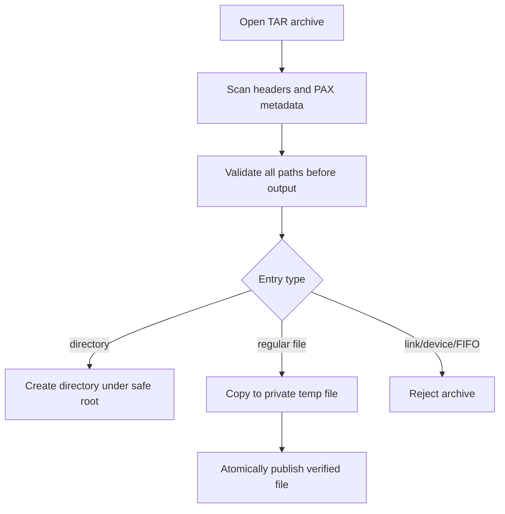
```mermaid
flowchart TD
    A["Open TAR archive"] --> B["Scan headers and PAX metadata"]
    B --> C["Validate all paths before output"]
    C --> D{"Entry type"}
    D -->|"directory"| E["Create directory under safe root"]
    D -->|"regular file"| F["Copy to private temp file"]
    F --> G["Atomically publish verified file"]
    D -->|"link/device/FIFO"| H["Reject archive"]
```

## CPIO Security Contract

The CPIO adapter is in-process and follows the same extraction model as TAR:

1. Parse every CPIO header and entry name.
2. Reject malformed names, unsafe paths, duplicate normalized paths, hard-link
   metadata, and special files before creating output.
3. Verify `070702` entry checksums during the validation pass.
4. Create output directories and publish regular files only after copying each
   payload into a private same-directory temporary file.

For `.cpio.gz`/`.cpgz`, the same contract applies after the Gzip filter. Both
passes must finish with valid Gzip trailers, the second pass must match the
metadata already accepted by the validation pass, and compressed CPIO must not
be treated as a generic single-file Gzip extraction.

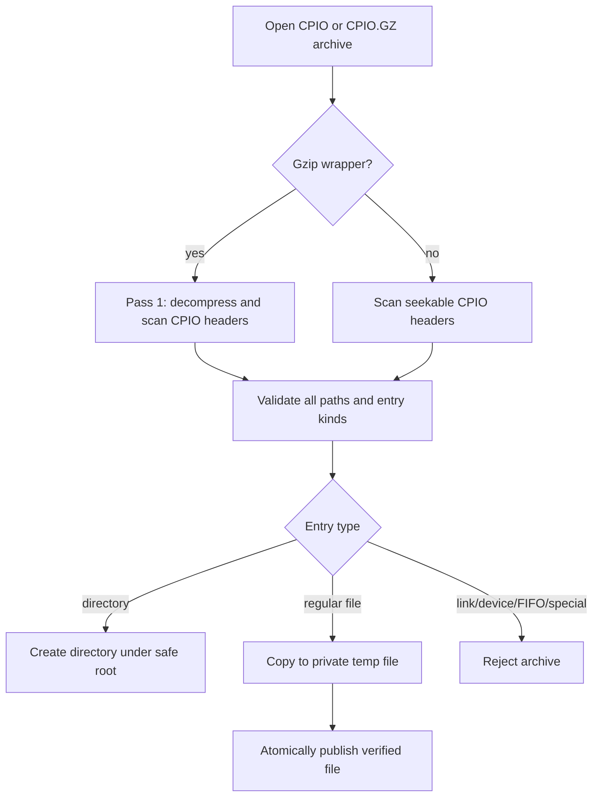
```mermaid
flowchart TD
    A["Open CPIO or CPIO.GZ archive"] --> B{"Gzip wrapper?"}
    B -->|"yes"| C["Pass 1: decompress and scan CPIO headers"]
    B -->|"no"| D["Scan seekable CPIO headers"]
    C --> E["Validate all paths and entry kinds"]
    D --> E
    E --> F{"Entry type"}
    F -->|"directory"| G["Create directory under safe root"]
    F -->|"regular file"| H["Copy to private temp file"]
    H --> I["Atomically publish verified file"]
    F -->|"link/device/FIFO/special"| J["Reject archive"]
```

## AR Security Contract

The AR adapter is in-process and validates archive-wide member names before
publishing any file payload:

1. Parse the global header, fixed-width member headers, and supported long-name
   variants.
2. Skip AR symbol/string-table metadata that is not an extractable file.
3. Reject malformed sizes, unsafe paths, duplicate normalized paths, and file
   entries that conflict with descendants.
4. Publish each regular-file member through a private same-directory temporary
   file after validation.

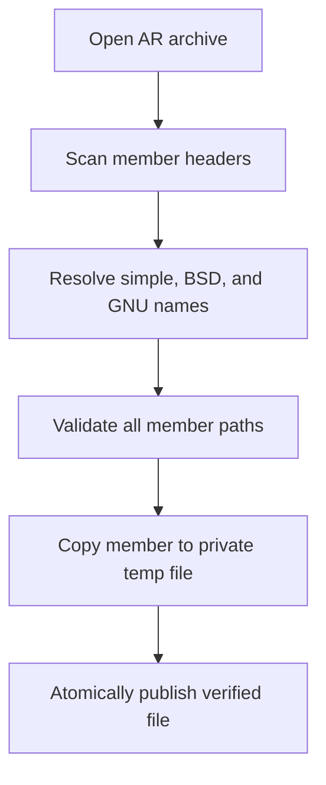
```mermaid
flowchart TD
    A["Open AR archive"] --> B["Scan member headers"]
    B --> C["Resolve simple, BSD, and GNU names"]
    C --> D["Validate all member paths"]
    D --> E["Copy member to private temp file"]
    E --> F["Atomically publish verified file"]
```

## ARJ Security Contract

The ARJ path is an in-process read-only parser for the current stored-entry
subset:

1. Parse the main header, local headers, extended headers, and end marker with
   the ARJ header CRC checks enabled.
2. Reject encrypted, split, compressed, label, chapter, malformed, oversized,
   or SFX-prefixed inputs before destination writes.
3. Normalize member names and validate the full archive path set before output.
4. Verify every stored regular-file payload CRC during the validation pass.
5. Reopen the archive and publish only validated directories and stored files
   through SuperZip's temporary-file commit path.

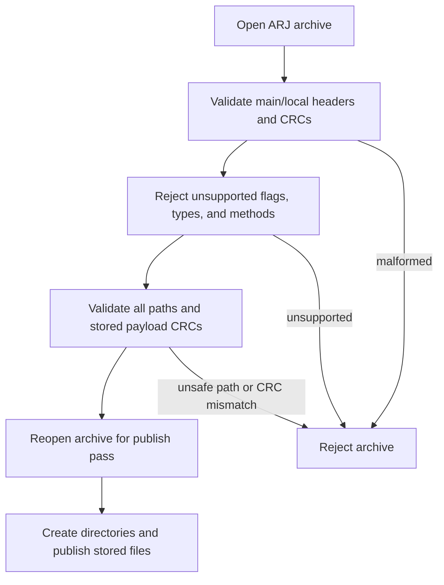
```mermaid
flowchart TD
    A["Open ARJ archive"] --> B["Validate main/local headers and CRCs"]
    B --> C["Reject unsupported flags, types, and methods"]
    C --> D["Validate all paths and stored payload CRCs"]
    D --> E["Reopen archive for publish pass"]
    E --> F["Create directories and publish stored files"]
    B -->|"malformed"| G["Reject archive"]
    C -->|"unsupported"| G
    D -->|"unsafe path or CRC mismatch"| G
```

## SEA ARC/ARK Security Contract

The SEA ARC/ARK path is an in-process read-only parser for the current unpacked
entry subset:

1. Parse sequential file headers with the `0x1A` marker and fixed 13-byte member
   name field.
2. Accept only method 1 and method 2 unpacked regular-file entries.
3. Reject compressed methods, unrelated `.arc` file families, SFX-prefixed
   scanning, malformed headers, trailing data after the end marker, and
   oversized outputs before destination writes.
4. Normalize member names and validate the full archive path set before output.
5. Verify CRC-16/ARC during the validation pass and again during publication.

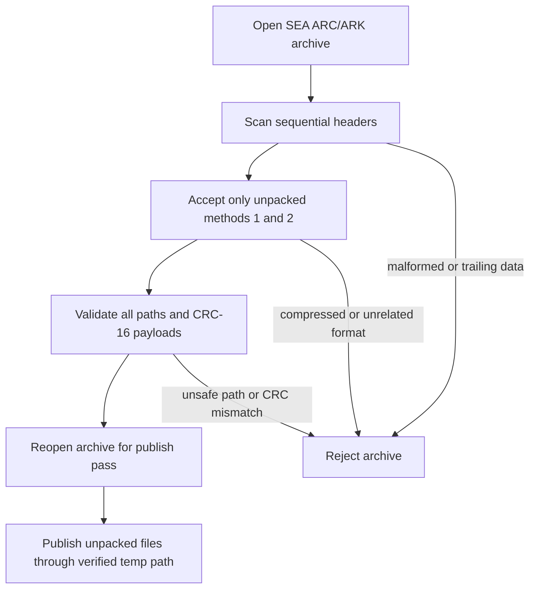
```mermaid
flowchart TD
    A["Open SEA ARC/ARK archive"] --> B["Scan sequential headers"]
    B --> C["Accept only unpacked methods 1 and 2"]
    C --> D["Validate all paths and CRC-16 payloads"]
    D --> E["Reopen archive for publish pass"]
    E --> F["Publish unpacked files through verified temp path"]
    B -->|"malformed or trailing data"| G["Reject archive"]
    C -->|"compressed or unrelated format"| G
    D -->|"unsafe path or CRC mismatch"| G
```

## DEB Security Contract

The DEB path is a format-specific route into the AR adapter:

1. Detect the `.deb` extension together with the AR global header.
2. Parse and validate outer AR members exactly as AR extraction does.
3. Extract regular outer members only.
4. Leave nested control/data tarballs as files unless a future package
   inspection feature explicitly requests nested extraction.

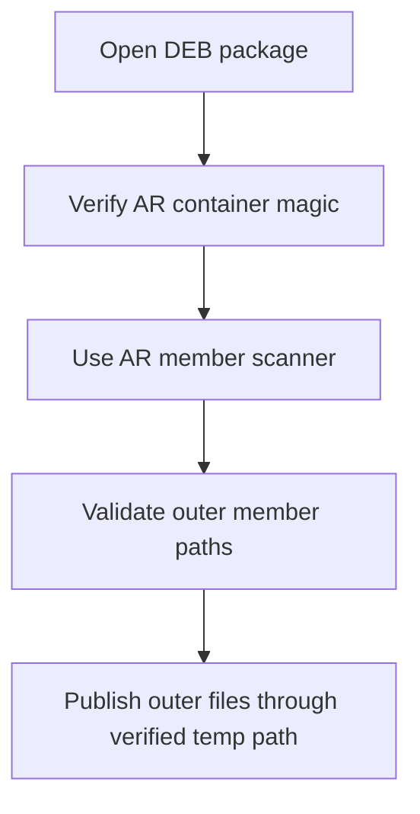
```mermaid
flowchart TD
    A["Open DEB package"] --> B["Verify AR container magic"]
    B --> C["Use AR member scanner"]
    C --> D["Validate outer member paths"]
    D --> E["Publish outer files through verified temp path"]
```

## RPM Security Contract

The RPM path is a format-specific route into the CPIO adapter:

1. Validate the RPM lead, signature header, package header, and payload
   descriptor with bounded header-entry and header-store sizes.
2. Accept only CPIO payloads and explicitly supported payload compression.
3. Reject mismatches between declared payload compression and payload magic.
4. Decode the payload into a private temporary file and route it through the
   CPIO adapter, so all package paths are validated before output.
5. Cap compressed and decoded temporary payload spooling before disk usage can
   grow without bound.
6. Remove known temporary payload files on success and failure.

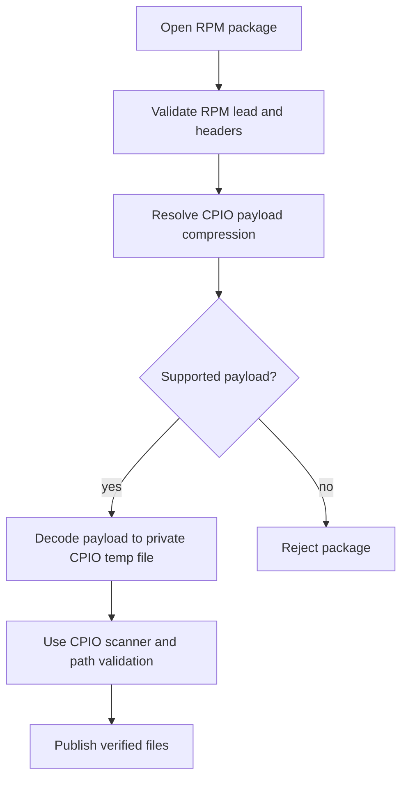
```mermaid
flowchart TD
    A["Open RPM package"] --> B["Validate RPM lead and headers"]
    B --> C["Resolve CPIO payload compression"]
    C --> D{"Supported payload?"}
    D -->|"yes"| E["Decode payload to private CPIO temp file"]
    E --> F["Use CPIO scanner and path validation"]
    F --> G["Publish verified files"]
    D -->|"no"| H["Reject package"]
```

## CAB Security Contract

The CAB path combines a SuperZip metadata scanner with Windows FDI streaming
decompression:

1. Validate the CAB magic, version, declared cabinet size, folder records, file
   table, data-block extents, and resource limits before FDI is invoked.
2. Reject previous/next-cabinet spanning flags, unsafe names, duplicate
   normalized paths, file/child conflicts, and unbounded total output.
3. Run a validation decompression pass to `NUL` so corrupt compressed data fails
   before destination files are created.
4. Run the extraction pass only for FDI callbacks whose normalized names and
   sizes match the scanner-approved table.
5. Publish each output through the standard private temporary file and atomic
   overwrite-safe commit path.

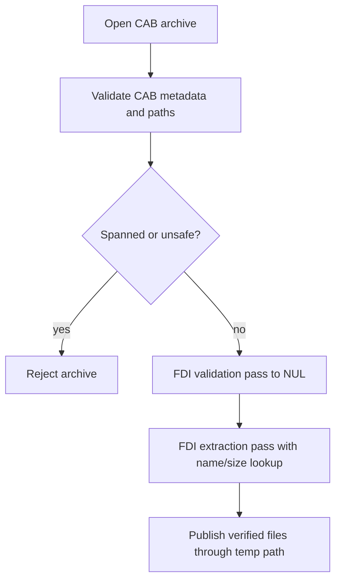
```mermaid
flowchart TD
    A["Open CAB archive"] --> B["Validate CAB metadata and paths"]
    B --> C{"Spanned or unsafe?"}
    C -->|"yes"| D["Reject archive"]
    C -->|"no"| E["FDI validation pass to NUL"]
    E --> F["FDI extraction pass with name/size lookup"]
    F --> G["Publish verified files through temp path"]
```

## 7z Security Contract

The 7z path uses the official LZMA SDK 26.01 decoder in process:

1. Open the archive through a bounded SDK input buffer and a SuperZip allocator
   budget.
2. Parse metadata, reject excessive entry counts, excessive names, unsafe
   paths, duplicate normalized paths, file/child conflicts, reparse points,
   devices, and unsupported POSIX special-file attributes.
3. Cap total decoded output and SDK allocation growth before any destination
   writes.
4. Decode all regular-file payloads once for CRC/size validation.
5. Reset the decoder cache, then publish only approved directories and regular
   files through the standard private temporary-file path.

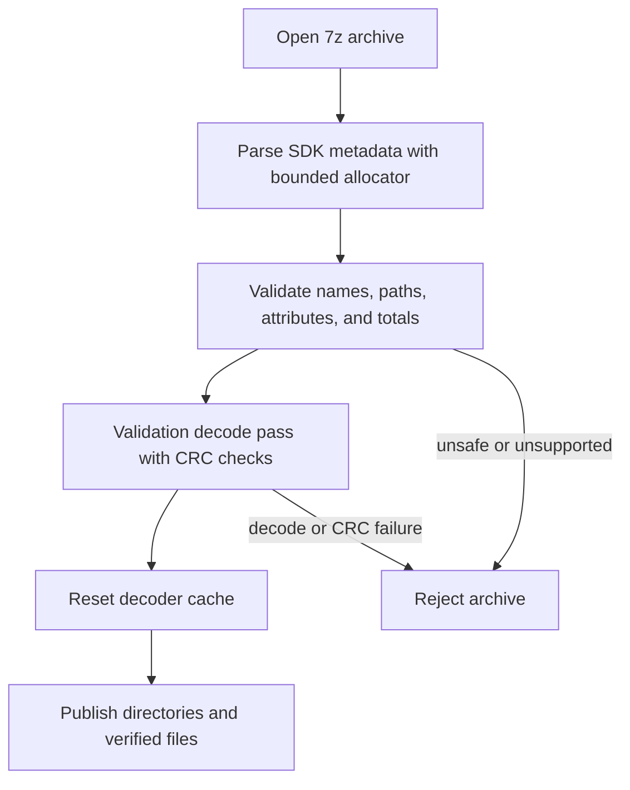
```mermaid
flowchart TD
    A["Open 7z archive"] --> B["Parse SDK metadata with bounded allocator"]
    B --> C["Validate names, paths, attributes, and totals"]
    C --> D["Validation decode pass with CRC checks"]
    D --> E["Reset decoder cache"]
    E --> F["Publish directories and verified files"]
    C -->|"unsafe or unsupported"| G["Reject archive"]
    D -->|"decode or CRC failure"| G
```

## LHA/LZH Security Contract

The LHA/LZH path uses the ISC-licensed Lhasa 0.5.0 decoder in process:

1. Open the archive through a SuperZip-owned C++ stream adapter and Lhasa reader.
2. Parse every entry with Lhasa using the plain directory policy so synthetic
   duplicate directory entries are not surfaced as product entries.
3. Reject excessive entry counts, excessive total decoded bytes, symlinks,
   unsafe paths, duplicate normalized paths, and file/child conflicts before
   destination writes.
4. Decode every regular-file payload once with Lhasa's CRC/size checker.
5. Reopen the archive for the publish pass, verify that metadata matches the
   validation pass, then publish only approved directories and regular files
   through the standard private temporary-file path.

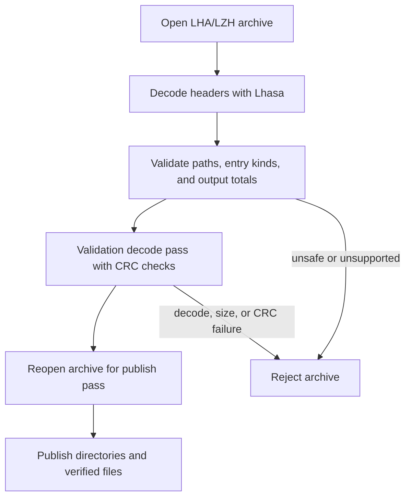
```mermaid
flowchart TD
    A["Open LHA/LZH archive"] --> B["Decode headers with Lhasa"]
    B --> C["Validate paths, entry kinds, and output totals"]
    C --> D["Validation decode pass with CRC checks"]
    D --> E["Reopen archive for publish pass"]
    E --> F["Publish directories and verified files"]
    C -->|"unsafe or unsupported"| G["Reject archive"]
    D -->|"decode, size, or CRC failure"| G
```

## XAR Security Contract

The XAR path is a native, read-only parser for a bounded subset of
eXtensible ARchiver files:

1. Validate the binary `xar!` header, version, TOC sizes, heap offset, and
   checksum mode before parsing XML.
2. Inflate the TOC with miniz and parse only the metadata fields required for
   directories, regular files, payload offsets, payload sizes, and payload
   encoding styles.
3. Reject TOC comments, DTDs, declarations, links, hard links, special files,
   unsupported payload encodings, duplicate paths, traversal, and file/child
   conflicts before output.
4. Decode every file payload once before destination writes start, then reopen
   and publish only verified regular files through the standard temporary-file
   path.
5. Fail closed on declared TOC checksum algorithms until checksum verification
   is implemented for that exact XAR variant.

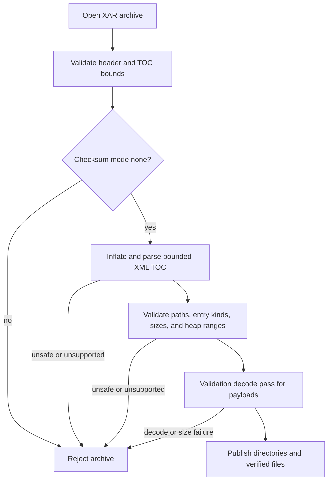
```mermaid
flowchart TD
    A["Open XAR archive"] --> B["Validate header and TOC bounds"]
    B --> C{"Checksum mode none?"}
    C -->|"no"| G["Reject archive"]
    C -->|"yes"| D["Inflate and parse bounded XML TOC"]
    D --> E["Validate paths, entry kinds, sizes, and heap ranges"]
    E --> F["Validation decode pass for payloads"]
    F --> H["Publish directories and verified files"]
    D -->|"unsafe or unsupported"| G
    E -->|"unsafe or unsupported"| G
    F -->|"decode or size failure"| G
```

## WIM Security Contract

The WIM path uses the bundled official wimlib 1.14.5 DLL from the executable
directory:

1. CMake verifies the pinned upstream package and extracted `libwim-15.dll`
   checksums before any executable is built or installed.
2. Runtime loading is restricted to the executable directory and checks
   wimlib version `1062917` (`1.14.5`).
3. Archives are opened read-only with integrity checking enabled and split-WIM
   rejection enabled.
4. Every image tree is scanned before extraction. Paths are normalized through
   SuperZip path-safety logic and multi-image archives are isolated under
   `image-N/` output prefixes.
5. Reparse points, hard links, alternate data streams, device entries,
   encrypted/offline/virtual files, missing resources, excessive image counts,
   excessive entry counts, and excessive decoded byte totals are rejected.
6. wimlib extracts only into a private SuperZip staging directory. Final output
   publication rechecks staged files for regular-file type, reparse-point
   absence, and exact size, then uses the standard temporary-file commit path.

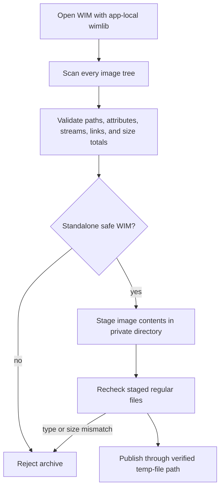
```mermaid
flowchart TD
    A["Open WIM with app-local wimlib"] --> B["Scan every image tree"]
    B --> C["Validate paths, attributes, streams, links, and size totals"]
    C --> D{"Standalone safe WIM?"}
    D -->|"no"| G["Reject archive"]
    D -->|"yes"| E["Stage image contents in private directory"]
    E --> F["Recheck staged regular files"]
    F --> H["Publish through verified temp-file path"]
    F -->|"type or size mismatch"| G
```

## Unix Compress Security Contract

The Unix Compress adapter is in-process and treats the LZW stream as untrusted
input:

1. Verify the `0x1F 0x9D` magic bytes, reject reserved header flags, and accept
   only declared maxbits from 9 through 16.
2. Keep prefix/suffix dictionaries bounded by the stream-declared maxbits.
3. Reject undefined, future, cyclic, or over-deep dictionary references.
4. Derive a single safe output filename from the archive path and publish it
   through the same verified temporary-file path used by other adapters.

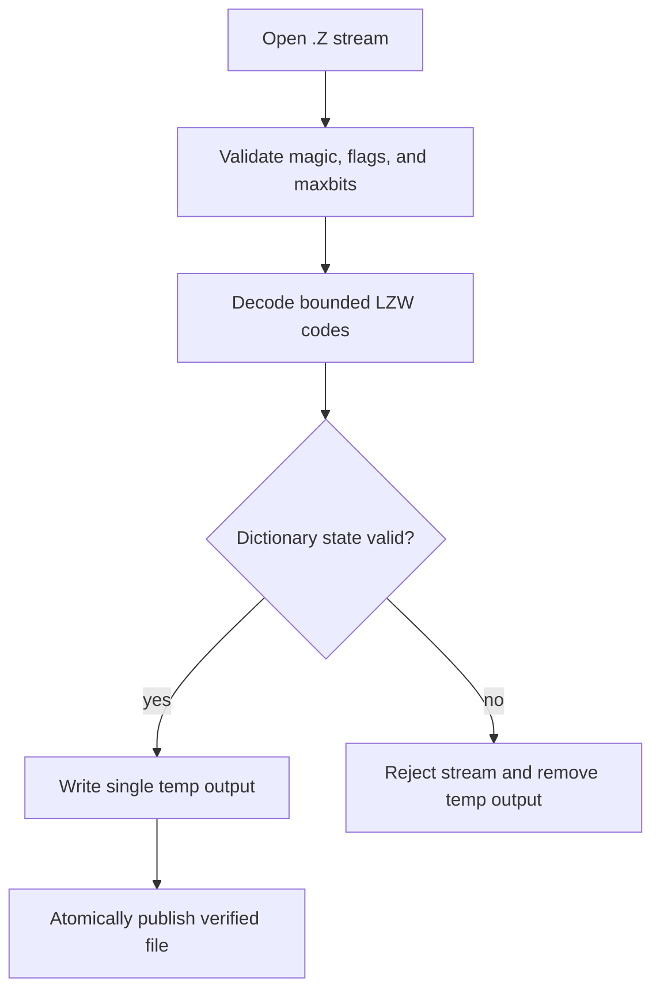
```mermaid
flowchart TD
    A["Open .Z stream"] --> B["Validate magic, flags, and maxbits"]
    B --> C["Decode bounded LZW codes"]
    C --> D{"Dictionary state valid?"}
    D -->|"yes"| E["Write single temp output"]
    E --> F["Atomically publish verified file"]
    D -->|"no"| G["Reject stream and remove temp output"]
```

## UUE Security Contract

The UUE path is an in-process single-file text decoder and writer:

1. Accept only a bounded preamble followed by a strict `begin <octal-mode>
   <filename>` line.
2. Validate the begin-line filename through `safe_join_archive_path` before any
   destination file is reserved.
3. Bound every encoded line and reject declared decoded line lengths above the
   UUE maximum of 45 bytes.
4. Require a zero-length line followed by `end`, then reject non-whitespace
   trailing data.
5. Publish the decoded file only after the complete stream has been decoded
   into a private temporary file.

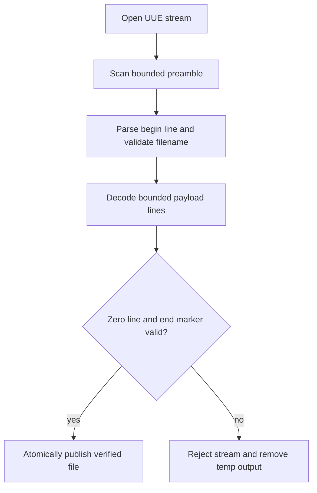
```mermaid
flowchart TD
    A["Open UUE stream"] --> B["Scan bounded preamble"]
    B --> C["Parse begin line and validate filename"]
    C --> D["Decode bounded payload lines"]
    D --> E{"Zero line and end marker valid?"}
    E -->|"yes"| F["Atomically publish verified file"]
    E -->|"no"| G["Reject stream and remove temp output"]
```

## Bzip2 Security Contract

The Bzip2 path is in-process through vendored libbzip2 1.0.8 and follows the
same publication rules as the other stream adapters:

1. `.bz2` accepts exactly one source file and derives one safe output filename
   from the archive path.
2. `.tar.bz2`/`.tbz`/`.tbz2` routes through the native TAR scanner, so all TAR
   paths are validated before any extraction output is published.
3. Corrupt Bzip2 streams, truncated streams, and trailing single-member data are
   rejected before final file publication.
4. Output is copied through private temporary files and committed only after the
   stream and metadata validation paths finish.

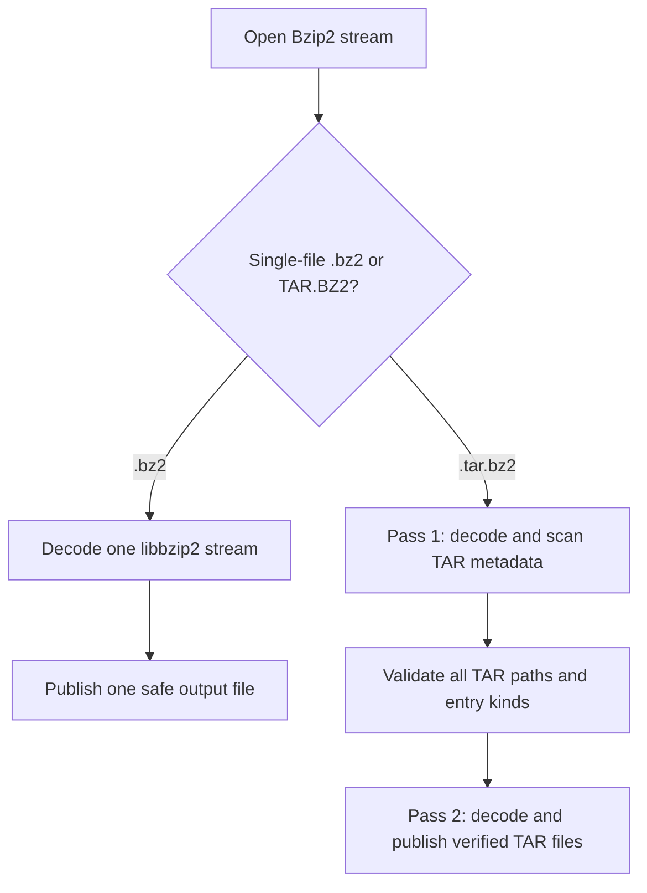
```mermaid
flowchart TD
    A["Open Bzip2 stream"] --> B{"Single-file .bz2 or TAR.BZ2?"}
    B -->|".bz2"| C["Decode one libbzip2 stream"]
    C --> D["Publish one safe output file"]
    B -->|".tar.bz2"| E["Pass 1: decode and scan TAR metadata"]
    E --> F["Validate all TAR paths and entry kinds"]
    F --> G["Pass 2: decode and publish verified TAR files"]
```

## XZ Security Contract

The XZ path is in-process through vendored XZ Embedded and follows the same
publication rules as the other stream adapters:

1. `.xz` extracts exactly one output file derived from the archive filename.
2. `.tar.xz`/`.txz` routes through the native TAR scanner, so all TAR paths are
   validated before any extraction output is published.
3. The decoder supports CRC64 and concatenated streams, but rejects unsupported
   filters and check types instead of skipping verification.
4. The LZMA2 dictionary is capped at the SuperZip wrapper boundary to prevent
   untrusted streams from exhausting host RAM.
5. XZ creation is not implemented or advertised in this release.

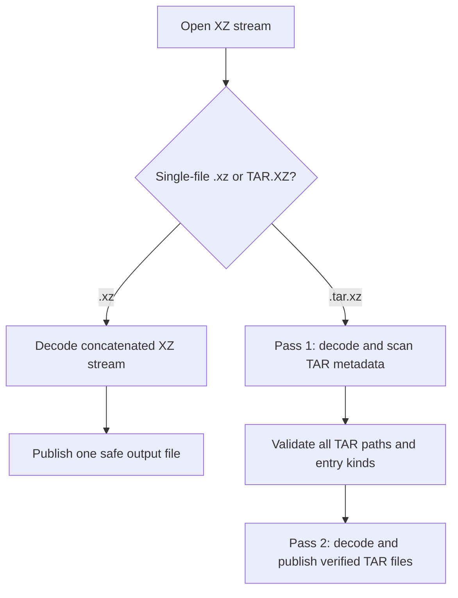
```mermaid
flowchart TD
    A["Open XZ stream"] --> B{"Single-file .xz or TAR.XZ?"}
    B -->|".xz"| C["Decode concatenated XZ stream"]
    C --> D["Publish one safe output file"]
    B -->|".tar.xz"| E["Pass 1: decode and scan TAR metadata"]
    E --> F["Validate all TAR paths and entry kinds"]
    F --> G["Pass 2: decode and publish verified TAR files"]
```

## LZMA Security Contract

The LZMA path is in-process through the official LZMA SDK 26.01 decoder and
follows the same publication rules as other single-file stream adapters:

1. `.lzma` accepts exactly one LZMA-Alone stream and derives one output file
   from the archive filename.
2. The fixed LZMA-Alone header is parsed before decoder allocation.
3. Dictionary declarations above 512 MiB and decoded output above the SuperZip
   pipeline limit are rejected before final publication.
4. SDK allocations are routed through a bounded allocator.
5. Unknown-size streams must reach an LZMA end marker; known-size streams must
   produce exactly the declared byte count.
6. Output is written to a private temporary file and committed only after the
   stream finishes according to the supported LZMA-Alone rules.

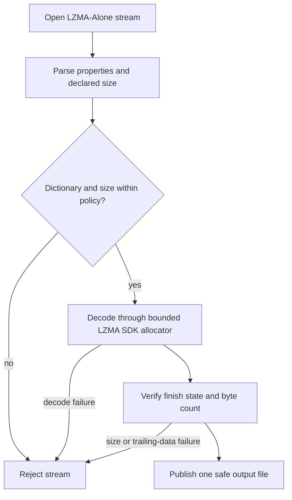
```mermaid
flowchart TD
    A["Open LZMA-Alone stream"] --> B["Parse properties and declared size"]
    B --> C{"Dictionary and size within policy?"}
    C -->|"no"| G["Reject stream"]
    C -->|"yes"| D["Decode through bounded LZMA SDK allocator"]
    D --> E["Verify finish state and byte count"]
    E --> F["Publish one safe output file"]
    D -->|"decode failure"| G
    E -->|"size or trailing-data failure"| G
```

## Lzip Security Contract

The lzip path is in-process through SuperZip's lzip wrapper decoder over the
vendored LZMA SDK 26.01 decoder:

1. `.lz` derives one safe output file from the archive filename.
2. `.tar.lz`/`.tlz` routes through the native TAR scanner, so all TAR paths are
   validated before any extraction output is published.
3. Each lzip member must use the `LZIP` magic, version 1, and a valid coded
   dictionary size between 4 KiB and 512 MiB.
4. Each member must reach the LZMA EOS marker and match the trailer CRC32,
   uncompressed data size, and member size before bytes are trusted.
5. Concatenated members are supported; trailing non-member data and empty
   members before another member are rejected.
6. SDK allocations are routed through a bounded allocator, and decoded output is
   capped by the SuperZip pipeline limit.

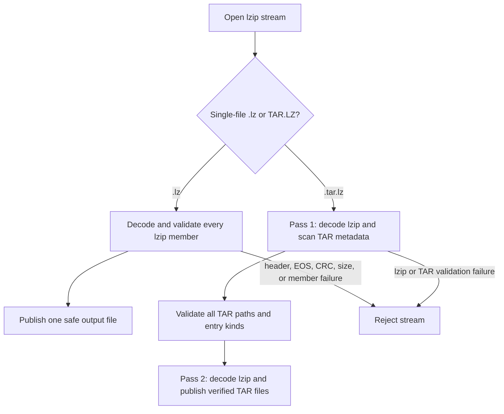
```mermaid
flowchart TD
    A["Open lzip stream"] --> B{"Single-file .lz or TAR.LZ?"}
    B -->|".lz"| C["Decode and validate every lzip member"]
    C --> D["Publish one safe output file"]
    B -->|".tar.lz"| E["Pass 1: decode lzip and scan TAR metadata"]
    E --> F["Validate all TAR paths and entry kinds"]
    F --> G["Pass 2: decode lzip and publish verified TAR files"]
    C -->|"header, EOS, CRC, size, or member failure"| H["Reject stream"]
    E -->|"lzip or TAR validation failure"| H
```

## Zstandard Security Contract

The Zstandard path is in-process through the bundled official libzstd 1.5.7 DLL
and follows the same publication rules as the other stream adapters:

1. `.zst`/`.zstd` accepts exactly one source file and derives one safe output
   filename from the archive path.
2. `.tar.zst`/`.tzst` routes through the native TAR scanner, so all TAR paths
   are validated before any extraction output is published.
3. SuperZip-created frames enable the Zstandard content checksum flag.
4. Extraction caps the frame window log at the wrapper boundary before
   decompression starts.
5. Malformed streams and trailing garbage are rejected before final file
   publication.

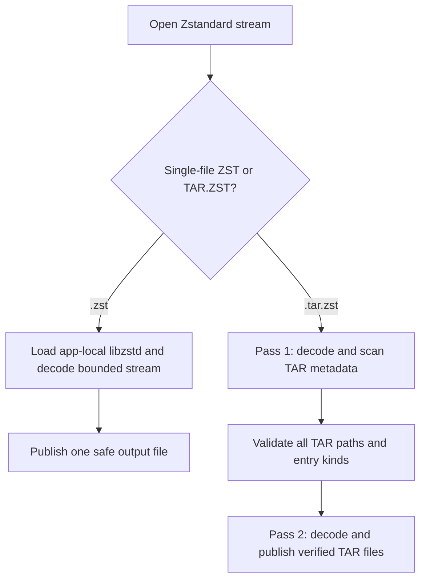
```mermaid
flowchart TD
    A["Open Zstandard stream"] --> B{"Single-file ZST or TAR.ZST?"}
    B -->|".zst"| C["Load app-local libzstd and decode bounded stream"]
    C --> D["Publish one safe output file"]
    B -->|".tar.zst"| E["Pass 1: decode and scan TAR metadata"]
    E --> F["Validate all TAR paths and entry kinds"]
    F --> G["Pass 2: decode and publish verified TAR files"]
```

## ISO Security Contract

The ISO path is a native, read-only parser for basic ISO 9660 directory records:

1. `.iso` extraction reads the Primary Volume Descriptor and root directory from
   the image; it does not shell out to system tools.
2. Directory records are scanned and validated before any output is written.
3. Every extracted path goes through the same SuperZip path-safety and
   archive-wide collision checks as ZIP, TAR, CPIO, and AR.
4. Interleaved and multi-extent records are rejected until an explicit policy
   and tests exist for them.
5. Rock Ridge, Joliet, UDF, boot catalog metadata, and filesystem attributes
   are not exposed as implemented features by this adapter.

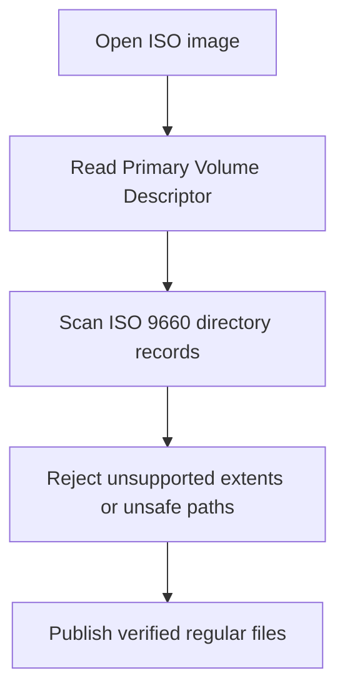
```mermaid
flowchart TD
    A["Open ISO image"] --> B["Read Primary Volume Descriptor"]
    B --> C["Scan ISO 9660 directory records"]
    C --> D["Reject unsupported extents or unsafe paths"]
    D --> E["Publish verified regular files"]
```

## Future Backend Gates

Before adding a new compatibility backend, the implementation must satisfy:

- In-process library or parser path. No hidden shelling to system tools.
- Pinned dependency version with provenance and license review.
- Bounded entry counts, metadata sizes, output sizes, and stream buffers.
- Pre-write archive-wide path validation.
- No symlink, device, alternate data stream, or special-file extraction until
  policy and tests exist.
- Fuzz target coverage for metadata parsing.
- CLI and GUI coverage plus malicious archive regression tests.
- Documentation update in this file, README, AGENTS, and release notes.

Preferred next increments are read-only RAR, broader ARJ and SEA ARC
compressed-method extraction, deeper ZIPX method coverage, lzip creation only
after a vetted in-process encoder exists, and the remaining recognized-only
legacy/container formats after backend selection and licensing review. XAR
checksum/signature validation is also a future hardening increment before
SuperZip can claim broad XAR compatibility. Write support for RAR is not
planned because the common RAR creation tooling is not a permissive open format
writer suitable for this repo. 7z creation also remains disabled until a vetted
in-process writer path passes the same gates.
