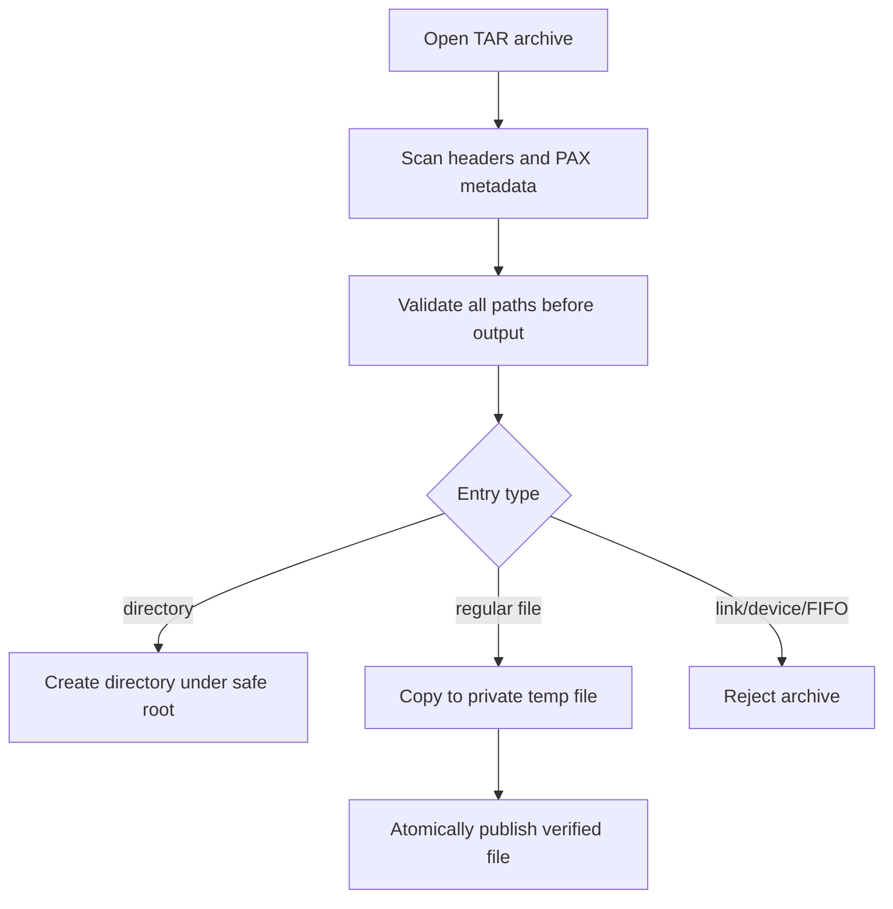
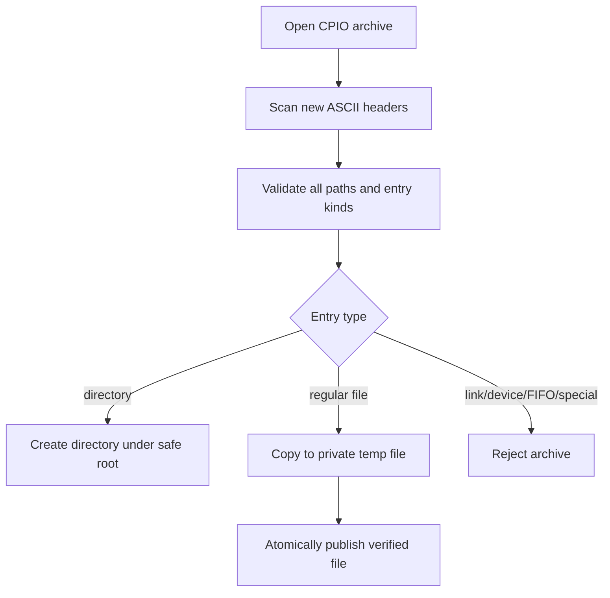

# Archive Format Support And Research

Research checked on 2026-06-16.

SuperZip is first a native AMD HIP `.suzip` application. Compatibility formats
must not change that boundary. A compatibility format is accepted only when it
has a direct in-process parser/writer path, clear resource limits, and the same
pre-write path validation used by SUZIP.

## Sources

Primary and project-owned sources reviewed:

- 7-Zip: https://www.7-zip.org/
- WinRAR: https://www.win-rar.com/
- WinZip format guide: https://www.winzip.com/en/learn/file-formats/
- WinZip supported-format table: https://kb.winzip.com/en/130365
- PeaZip: https://peazip.github.io/
- PeaZip source matrix: https://github.com/peazip/PeaZip/
- Bandizip: https://en.bandisoft.com/bandizip/
- Keka: https://www.keka.io/en/
- The Unarchiver: https://theunarchiver.com/
- libarchive: https://www.libarchive.org/
- GNU cpio manual: https://www.gnu.org/software/cpio/manual/
- FreeBSD cpio format manual: https://man.freebsd.org/cgi/man.cgi?query=cpio&sektion=5
- NanaZip: https://github.com/M2Team/NanaZip
- GNOME File Roller: https://gitlab.gnome.org/GNOME/file-roller
- KDE Ark: https://apps.kde.org/ark/
- PowerArchiver: https://www.powerarchiver.com/
- IZArc: https://www.izarc.org/
- BetterZip: https://betterzip.app/library/betterzip/docs/archive-types/
- Xarchiver: https://xarchiver.sourceforge.net/
- Microsoft Windows archive support: https://support.microsoft.com/en-us/windows/zip-and-unzip-files-8d28fa72-f2f9-712f-67df-f80cf89fd4e5

Secondary sources were used only where a current vendor page did not publish a
complete format matrix:

- B1 Free Archiver overview: https://en.wikipedia.org/wiki/B1_Free_Archiver
- ALZip store listing: https://apps.microsoft.com/detail/9wzdncrdct3q
- Zipware help/news: https://www.zipware.org/
- jZip review and format table: https://www.lifewire.com/jzip-review-1356305

These tools consistently cluster around real archive/container formats:
ZIP, ZIPX, 7z, RAR, TAR, GZIP, BZIP2, XZ, Zstandard, CAB, ISO, CPIO, ARJ,
LHA/LZH, WIM, XAR, DEB, and RPM. SuperZip's compatibility scope is limited to
real archive formats with explicit product behavior.

## Top-Tool Format Research Matrix

This matrix records what the reviewed tools expose at a product level. Package
and application-container aliases are intentionally omitted unless they are
already real archive/package formats in SuperZip's matrix.

| Tool | Write/create formats observed | Read/extract formats observed | SuperZip implication |
| --- | --- | --- | --- |
| 7-Zip | 7z, XZ, BZIP2, GZIP, TAR, ZIP, WIM | Adds AR, ARJ, CAB, CPIO, DMG, ISO, LHA/LZH, RAR, RPM, UDF, VHD/VHDX, VMDK, XAR, Z and others | Strong baseline for ZIP/TAR/GZIP/XZ/BZIP2/WIM recognition; RAR remains read-only candidate |
| NanaZip | 7-Zip-derived Windows app; use 7-Zip's core families as the baseline | 7-Zip-derived Windows app; format surface tracks the 7-Zip lineage plus NanaZip-specific codecs over time | Treat as a modern Windows UX reference, not a separate backend source |
| WinRAR | RAR and ZIP | RAR, ZIP, CAB, ARJ, LZH, TAR, GZ/TGZ, XZ, BZ2/TBZ, UUE, 7Z, Z, ISO | RAR write is not planned; read-only RAR needs licensing/security review |
| WinZip | ZIP/ZIPX, LHA/LZH, UUE | ZIP/ZIPX plus RAR, 7z, TAR, GZIP, VHD, XZ and other common formats | ZIPX is a compatibility target only after a vetted backend exists |
| PeaZip | 7Z, ARC, Brotli, BZ2, GZ, PEA, TAR, WIM, XZ, ZIP, Zstandard and others | Very broad read matrix including 7Z, ACE, ARJ, Brotli, BZ2, CAB, CPIO, DEB, GZ, ISO, LHA/LZH, RAR, RPM, TAR, WIM, XZ, ZIP, ZIPX, Zstandard | Confirms that broad recognition should be separate from implementation claims |
| Bandizip | ZIP, 7Z, ZIPX, EXE/SFX, TAR, TGZ, LZH, ISO, GZ, XZ | Same advertised product set, with 7Z method caveats | Supports prioritizing compressed TAR and XZ after Gzip |
| Keka | 7Z, ZIP, TAR, Zstandard, GZIP, BZIP2 | 7Z, ZIP, RAR, TAR, GZIP, BZIP2, XZ, Zstandard, ISO, LZMA, CAB, MSI, CPIO and others | Single-stream formats are common create targets but must stay single-file in SuperZip |
| The Unarchiver | Extract-only product | ZIP, ZIPX, RAR, TAR variants, 7z, LHA/LZH, StuffIt-family and many legacy formats | Read-only UX reference; not a write-support model |
| libarchive/bsdtar | TAR, PAX, CPIO, ZIP, XAR, AR, ISO, mtree, shar with compression filters | TAR, PAX, CPIO, ZIP, XAR, LHA/LZH, AR, CAB, RAR, ISO and filters including gzip, bzip2, lzip, xz, lzma, compress | Best candidate family for future broad in-process compatibility after license/build review |
| GNOME File Roller | Depends on installed backends; common set includes TAR variants, ZIP, XZ | Broad backend-driven extraction including TAR variants, ZIP, XZ and many package/archive formats | Backend-wrapper model is not acceptable for SuperZip production paths |
| KDE Ark | Backend-driven create/modify/extract for common formats | TAR, GZIP, BZIP2, RAR, ZIP, 7z, CD images and more when backends exist | Useful UX reference; backend dependency model is not acceptable |
| PowerArchiver | ZIP and 7Z highlighted; product advertises 60+ formats | 60+ formats including ZIP, 7Z, RAR, TAR, ISO, CAB and legacy/proprietary formats | Enterprise comparison point; broad claims need explicit backend proof in SuperZip |
| IZArc | ZIP/RAR/7Z/ISO-focused product surface with 40+ format claim | 40+ formats including ZIP, RAR, 7Z, ISO and legacy formats | Legacy breadth does not justify unsupported parser risk |
| B1 Free Archiver | B1 and ZIP | B1, ZIP, RAR, 7z, GZIP, TAR.GZ, TAR.BZ2, ISO and other popular formats | B1 is low-priority until an open, maintained backend exists |
| Zipware | ZIP-focused creation | Major archive formats including ZIP, RAR and 7z | Confirms ZIP/RAR/7z expectations for Windows users |
| ALZip | EGG and other advertised archive outputs | 40+ formats including EGG, 7z and RAR | Proprietary EGG/ALZ formats stay recognition-only unless a vetted parser exists |
| BetterZip | ZIP, TAR, TGZ, TBZ, TXZ, 7-ZIP, DMG, Zstandard, Brotli, optional external RAR | Adds ARJ, LHA/LZH, ISO, CHM, CAB, CPIO/CPGZ, DEB, RPM, StuffIt-family, BinHex, MacBinary, GZip, BZip2, WIM | Confirms Zstandard/Brotli interest, but external RAR is not a SuperZip model |
| Xarchiver | Frontend over installed tools for common archive formats | 7z, ARJ, BZIP2, GZIP, RAR, LHA/LZH, LZMA, LZOP, DEB, RPM, TAR, ZIP | Wrapper design is explicitly rejected for production support |
| Windows 11 Explorer | Built-in shell compression/decompression for selected formats; encrypted archive handling is limited | ZIP and newer built-in support for additional formats such as 7z, with encryption limitations | SuperZip must be clearer and safer than shell support, especially for encrypted/unsupported cases |
| jZip | 7Z, BZ2, GZ, TAR, ZIP | 7Z, ARJ, BZ2, CAB, CPIO, DEB, GZ, ISO, LHA/LZH, RAR, RPM, TAR, WIM, Z, ZIP and more | Legacy reference only; no backend or UX copying |

## Current Product Matrix

| Format | Create | Extract | Status | Backend |
| --- | --- | --- | --- | --- |
| `.suzip` | Yes | Yes | Native GPU-first product format | SuperZip AMD HIP codec |
| `.zip` | Yes | Yes | Compatibility format | vendored miniz 3.1.1 |
| `.tar` | Yes | Yes | Compatibility format | native bounded TAR adapter |
| `.tar.gz`, `.tgz` | Yes | Yes | Compatibility format | native TAR stream adapter over vendored miniz 3.1.1 raw deflate |
| `.gz` | Yes | Yes | Single-file compatibility stream | vendored miniz 3.1.1 raw deflate |
| `.cpio` | Yes | Yes | Compatibility format | native SVR4 new ASCII CPIO adapter |
| `.7z` | No | No | Recognized only | pending vetted backend |
| `.rar` | No | No | Recognized only | pending read-only backend and licensing review |
| `.tar.bz2`, `.tbz2` | No | No | Recognized only | pending stream compressor layer |
| `.tar.xz`, `.txz` | No | No | Recognized only | pending stream compressor layer |
| `.tar.zst`, `.tzst` | No | No | Recognized only | pending stream compressor layer |
| `.bz2`, `.xz`, `.zst` | No | No | Recognized only | pending single-stream support |
| `.cab`, `.iso`, `.arj`, `.lha`, `.lzh`, `.wim`, `.xar`, `.deb`, `.rpm` | No | No | Recognized only | pending format-specific security review |

The CLI exposes this matrix with:

```powershell
build\Release\superzip_cli.exe formats
build\Release\superzip_cli.exe identify archive.tar
```

`extract` defaults to format auto-detection. Unsupported recognized formats fail
with a clear "recognized but not yet implemented" error. SuperZip does not
silently shell out to external archive utilities and does not fall back between
formats.

Gzip support is intentionally single-file when used as `.gz`. It does not
represent a multi-entry archive, and extraction derives the output filename
from the `.gz` archive path rather than trusting optional embedded original-name
metadata. TAR+Gzip support is multi-entry because the TAR stream supplies the
entry table; SuperZip validates that TAR stream in one decompression pass before
extracting in a second pass.

CPIO support covers the SVR4 new ASCII formats with magic values `070701` and
`070702`. Creation writes `070701`. Extraction accepts both variants and verifies
the simple payload checksum for `070702` before output. The adapter supports
regular files and directories only; symbolic links, hard-link metadata, devices,
FIFOs, and other special entries are rejected until SuperZip has a dedicated
policy and UI for those objects.

## ZIP-Container Alias Policy

Several non-archive file types use ZIP internally. SuperZip does not expose
those aliases as archive formats, does not market them as compatibility
coverage, and only keeps an internal deny-list to prevent false ZIP detection.
Package inspection needs a separate product requirement, security review, and
UI policy before it can enter this matrix.

## TAR Security Contract

The TAR adapter is in-process and uses a two-pass extraction model:

1. Scan every header and metadata record.
2. Reject unsafe paths, duplicate normalized paths, file/child conflicts, links,
   devices, FIFOs, malformed checksums, and unreasonable metadata counts.
3. Create output directories and publish regular files only after copying each
   payload into a private same-directory temporary file.

TAR symbolic links, hard links, device entries, and FIFOs are rejected. This is
intentional: extracting those entries safely on Windows needs a dedicated policy
and UI surface.



## CPIO Security Contract

The CPIO adapter is in-process and follows the same extraction model as TAR:

1. Parse every CPIO header and entry name.
2. Reject malformed names, unsafe paths, duplicate normalized paths, hard-link
   metadata, and special files before creating output.
3. Verify `070702` entry checksums during the validation pass.
4. Create output directories and publish regular files only after copying each
   payload into a private same-directory temporary file.



## Future Backend Gates

Before adding a new compatibility backend, the implementation must satisfy:

- In-process library or parser path. No hidden shelling to system tools.
- Pinned dependency version with provenance and license review.
- Bounded entry counts, metadata sizes, output sizes, and stream buffers.
- Pre-write archive-wide path validation.
- No symlink, device, alternate data stream, or special-file extraction until
  policy and tests exist.
- Fuzz target coverage for metadata parsing.
- CLI and GUI coverage plus malicious archive regression tests.
- Documentation update in this file, README, AGENTS, and release notes.

Preferred next increments are `.tar.bz2`, `.tar.xz`, and `.tar.zst` stream
filters, then read-only 7z, ISO, CAB, and RAR after backend selection and
licensing review. Write support for RAR is not planned because the common RAR
creation tooling is not a permissive open format writer suitable for this repo.
