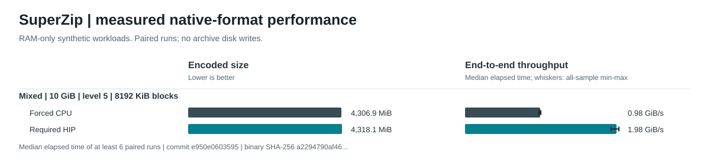

# Native Beta Block-Size Qualification — 3 October 2026

Seven independent studies cover every production block size at effort 5 on a
generated **10 GiB Mixed** workload. All 154 observations completed required
byte-exact validation. Only the 8 MiB case meets every predeclared descriptive
timing-quality safeguard. Its observed CPU/GPU mean combined-time ratio is
2.0094; the GPU archive is **11,768,213 bytes (0.2606%) larger**.
This is a workload-specific observation, not a before/after improvement,
statistical-significance claim, competitor ranking or release acceptance.

## Frozen Identity And Protocol

- Clean source: `e950e06035959b81938ca7bb64c45d64980b545f`.
- CLI SHA-256: `a2294790af46e0cf243c5012381c41760ba1bd52af517109004c60d9219a0b06`.
- Native input digest: `2319e61aff7fed492a9dd44fa7e8fb6c6a9f85e968716ff94910b5d60d6ca940`.
- Portable build-receipt digest: `5f3f3abddb07bd276b2c29af704d93df80b9a631aa2358b750322899c7001ada`.
- Hardware: AMD Ryzen 9 9950X; AMD Radeon RX 9070 XT.
- Complete pinned ROCm Core SDK 10.0.0 distribution; observed driver HIP runtime
  version `10.0.3679.0`. Distribution and component versions
  are distinct; see [toolchain provenance](../rocm-toolchain.md).
- Each independent case has three pilots per lane and a pilot-selected fixed
  confirmation count. Minimum 5, maximum 1,024; minimum combined measured time
  30 seconds per lane; all-phase CV limit 5%; independence-assuming RSE target 2%.
- All 42 pilots and 112 confirmations are retained separately. Counts never
  changed during confirmation. No warm-up observations, trimming, winsorization
  or speed-based exclusions. Each lane receives the same count for its case.
- Case order was 16 MiB down to 256 KiB in separate studies. CPU/GPU order
  alternated within each study, with 250 ms pauses outside product timers.
  Block sizes were not counterbalanced across these separate studies; the
  table does not establish an optimal block size.
- Frozen worker geometry, required-HIP telemetry and full resource observations
  are in each linked record. Every pilot and confirmation reports
  `memory_only=true`, `disk_write_bytes=0`, and all input bytes validated.

The source is synthetic generated data, not an authentic file corpus. The Mixed
profile exercises pattern/prefix compression but produces no dictionary or
sparse-pattern blocks in these studies. The actual-file
[household-power diagnostic](household-power-diagnostic-2026-10-03.md) is separate
evidence with a different measurement identity; it is not pooled here.

## All Completed Cases

Every input is **10,737,418,240 bytes**. Times are arithmetic mean ± sample SD
(`n - 1`) of compress + CRC verify + extract seconds over **all confirmations**.
The full modeled SUZIP archive byte count includes framing/index overhead;
it is distinct from `output_bytes` (encoded payload). No filesystem archive was
created. Exact phase summaries, ratios, worker counts and HIP telemetry are
retained in the numerical record linked by each block size.

| Block KiB / record | Confirmations per lane | CPU seconds ± SD | HIP seconds ± SD | CPU archive bytes | HIP archive bytes | Timing quality |
| ---: | ---: | ---: | ---: | ---: | ---: | --- |
| [16,384](data/beta-mixed-l5-b16384-20261003.json) | 8 | 10.852588 ± 0.233862 | 5.104007 ± 0.124777 | 4,516,058,195 | 4,526,528,555 | Inconclusive |
| [8,192](data/beta-mixed-l5-b8192-20261003.json) | 6 | 10.205179 ± 0.086281 | 5.078817 ± 0.106956 | 4,516,089,518 | 4,527,857,731 | Descriptively stable |
| [4,096](data/beta-mixed-l5-b4096-20261003.json) | 8 | 10.034168 ± 0.092744 | 5.158155 ± 0.080614 | 4,516,153,879 | 4,530,520,631 | Inconclusive |
| [2,048](data/beta-mixed-l5-b2048-20261003.json) | 8 | 9.631177 ± 0.068971 | 5.374425 ± 0.104030 | 4,516,280,994 | 4,535,842,123 | Inconclusive |
| [1,024](data/beta-mixed-l5-b1024-20261003.json) | 11 | 9.357649 ± 0.060587 | 5.558600 ± 0.116292 | 4,516,534,055 | 4,546,487,579 | Inconclusive |
| [512](data/beta-mixed-l5-b512-20261003.json) | 9 | 9.055979 ± 0.035003 | 5.705557 ± 0.130039 | 4,517,025,225 | 4,567,776,791 | Inconclusive |
| [256](data/beta-mixed-l5-b256-20261003.json) | 6 | 9.624524 ± 0.012132 | 5.509583 ± 0.096823 | 4,518,088,166 | 4,572,118,255 | Inconclusive |

All seven GPU archives are larger than their CPU counterpart. Lower observed
GPU combined time does not mean every individual phase is faster. At 8 MiB,
mean compress/verify/extract times are CPU **8.343660 / 0.921084 / 0.940435 s**
and GPU **3.236595 / 0.772587 / 1.069635 s**: GPU extraction was slower.

## Timing Admission And Plot



The chart admits the sole case satisfying every declared safeguard, rather than
selecting the fastest case. It uses **encoded payload bytes** and throughput
derived from median combined elapsed time, with the full observed min/max
confirmation range. The table uses means and full archive bytes. Whiskers are
not confidence intervals. Six inconclusive cases remain above and below; their
samples are not discarded or extended after examining confirmation results.

| Block KiB | Lane | Declared safeguard issues |
| ---: | --- | --- |
| 16,384 | CPU | None |
| 16,384 | GPU | high_variability: ExtractSeconds, planning_precision_not_met: ExtractSeconds |
| 8,192 | CPU | None |
| 8,192 | GPU | None |
| 4,096 | CPU | None |
| 4,096 | GPU | high_variability: ExtractSeconds, planning_precision_not_met: ExtractSeconds |
| 2,048 | CPU | None |
| 2,048 | GPU | high_variability: ExtractSeconds, high_variability: VerifySeconds, planning_precision_not_met: ExtractSeconds, planning_precision_not_met: VerifySeconds |
| 1,024 | CPU | None |
| 1,024 | GPU | high_variability: ExtractSeconds, high_variability: VerifySeconds |
| 512 | CPU | None |
| 512 | GPU | high_variability: ExtractSeconds, high_variability: VerifySeconds |
| 256 | CPU | None |
| 256 | GPU | high_variability: ExtractSeconds, planning_precision_not_met: ExtractSeconds |

CV describes underlying variation; more repetitions do not guarantee lower CV.
The pilot-derived RSE plan assumes independence and is approximate. Stable
descriptive labels do not prove significance, absent serial correlation or
absence of thermal drift. Process CPU/GPU percentages span the entire child
lifetime, including extra validation; they are not phase-specific counters.
Summed worker stage or HIP event time can exceed elapsed time because work
overlaps. Neither quantity should be substituted for the elapsed phase timer.

## Retained Aborted Setup

An earlier single-study seven-block attempt prescribed five pilots and at least
five confirmations per lane with a 1,500-second suite budget. Its first complete
pilot round projected at least **2,079.352688 seconds** for that prescribed work,
so the owned bounded process tree was stopped before confirmation. Its 29
complete raw operations and pilot samples remain in the local journal, SHA-256
`e98eaee6489c8982fcedabcb050b7d8c22370d5e35312e9cc5517d2e3e1832ba`.
No final record or confirmation plan was produced. It is an under-budgeted,
incomplete setup, never passed evidence or a speed-based sample exclusion.
The shutdown helper encountered an already-exited-process bookkeeping race;
shutdown and unchanged journal contents were verified separately. The seven
new studies above have independent budgets, journals and frozen plans. Their
observations are not pooled with the aborted setup.

## Reproduce

Run each block as a **new independent study** on an idle eligible HIP host,
using the pinned complete SDK and a current successful native build receipt.
Choose a sufficient bounded suite budget from pilot wall lifetimes; 600 seconds
per case fit this host, but does not guarantee completion on another system.
Never reduce counts to fit a budget or repeat until a favorable result appears.

```powershell
tools/bench.ps1 -Configuration Release -SizeMiB 10240 -Profile Mixed -CompressionLevel 5 -Iterations 5 -PilotIterations 3 -MaxIterations 1024 -MinimumMeasuredSeconds 30 -SuiteTimeoutSeconds 600 -RunTimeoutSeconds 300 -BlockSizeKiB 8192 -JsonOutput out/new-mixed-l5-b8192.json
py -3 tools/render_benchmark_graph.py --input docs/benchmarks/data/beta-mixed-l5-b8192-20261003.json --output resources/benchmarks/beta-native-cpu-hip.svg --check
```

The linked JSON files retain every exported pilot and confirmation unchanged.
They were checked independently against raw native statistics and their full
stage journals before publication; the private journals remain local diagnostic
artifacts. The scientific graph validator recomputes admission from raw exported
samples. See the [sampling contract](../performance-block-size-validation.md#scientific-sample-planning).

## Beta Qualification Still Pending

This is one finished part of intermediate beta preparation. Fresh effort-level,
additional profile and permission-checked comparator studies, supported-format
qualification, package/MSI smoke and final exact-SHA hosted acceptance remain
separate gates. Known unresolved security findings remain failures, not passed
release checks. No beta tag or publication is authorized by this report.
