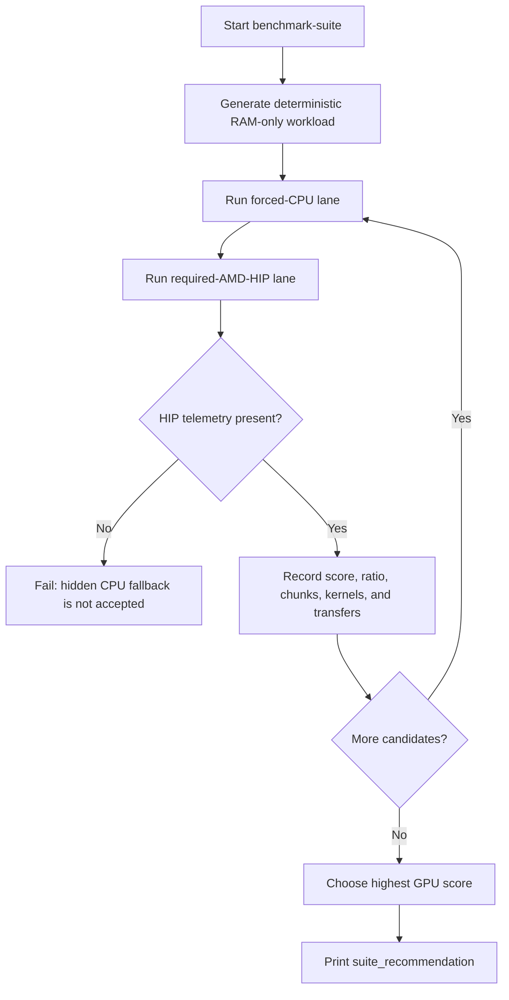

# Compression Levels And Benchmark Suite

This document defines SuperZip's compression-level UI, CPU/GPU comparison
rules, numerical benchmark score, and autotuning behavior.

## References Checked

Checked on 2026-06-15:

- zlib manual: <https://zlib.net/manual.html>
- 7-Zip command-line method switch manual mirror: <https://7-zip.opensource.jp/chm/cmdline/switches/method.htm>

The common pattern is a 0-9 compression scale where 0 means store/no
compression, 1 means fastest, 5 is a normal/default balance in several tools,
and 9 is maximum compression. SuperZip's native GPU archive path is not a store
mode, so the product exposes the non-store levels.

## Product Levels

| UI label | CLI value | Purpose |
| --- | ---: | --- |
| Fastest | `--compression-level 1` | Lowest effort for quick local transfers. |
| Fast | `--compression-level 3` | Speed-biased compression. |
| Balanced | `--compression-level 5` | Default release baseline for benchmarks and normal use. |
| Strong | `--compression-level 7` | Ratio-biased compression. |
| Maximum | `--compression-level 9` | Highest miniz effort. |

Level 5 is the default in `CompressOptions`, GPU codec options, the CLI, the
GUI, and `tools\bench.ps1`. Benchmarks may sweep all five levels, but release
throughput claims must identify the selected level and compression ratio. The
required-HIP v2 native codec can emit GPU fill, GPU pattern, and GPU
static-prefix blocks; the static-prefix path is selected by measured block
savings rather than by pretending to be Deflate or Zstandard.

## Benchmark Score

The built-in suite is intentionally RAM-only. It uses the same generated
workload, block codec, worker allocation, and required-GPU policy as
`memory-benchmark`, then prints one `suite_case` line per candidate and one
`suite_recommendation` line.

```powershell
build\Release\superzip_cli.exe benchmark-suite --profile Mixed --compression-level 5 --tune
```

The score is:

```text
round(((compress MiB/s * 0.50) + (verify MiB/s * 0.25) + (extract MiB/s * 0.25)) * 10)
```

Higher is better for the same workload size, profile, compression level, and
hardware state. The score is not comparable across different profiles or
compression levels unless the compression ratio is also analyzed.

## Autotuning Flow



`--tune` sweeps the production block sizes: 256 KiB, 512 KiB, 1 MiB, 2 MiB,
4 MiB, 8 MiB, and 16 MiB. `--tune-levels` additionally sweeps levels 1, 3, 5, 7, and 9, but the
recommendation refuses candidates whose compression ratio is more than 2%
worse than the balanced level-5 default candidate. That prevents the autotuner
from simply selecting weaker compression to inflate speed.

The Mixed benchmark profile must include fill-like bytes, repeated text,
low-entropy non-pattern bytes, and incompressible bytes. The low-entropy region
is required because real chunked scientific data can already be filtered or
compressed before archiving; a benchmark made only of zero/text/random regions
would not detect required-HIP codecs that fail to compact those streams.

## Required Evidence

Every benchmark-suite or release benchmark record must include:

- Workload size and profile.
- Compression level and compression ratio.
- CPU and required-GPU scores or throughput on the same candidate.
- `memory_only=true` and `disk_write_bytes=0`.
- Required-GPU proof: nonzero HIP kernel launches, HIP event time,
  host-to-device transfer bytes, and device allocation bytes.
- Native GPU compression proof: `gpu_prefix_blocks` or `gpu_pattern_blocks`
  must be nonzero when a benchmark claims required-HIP payload compression
  rather than only GPU CRC/materialization work.
- Block size and worker allocation.

## SSD-Wear Boundary

The suite never writes the generated 10 GiB workload to storage. The only
allowed storage validation remains `tools\storage_smoke.ps1` or the capped
64 MiB filesystem mode in `tools\bench.ps1`, both of which are correctness
smokes rather than performance benchmarks.
