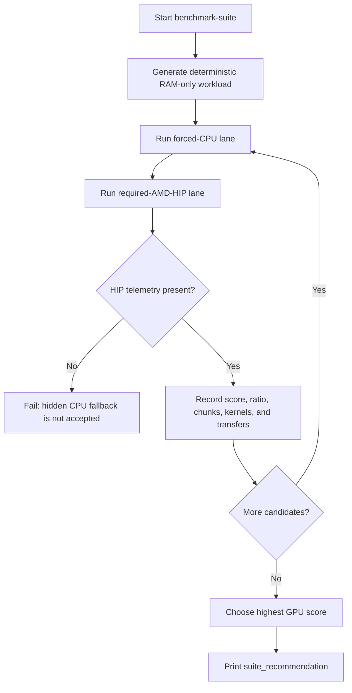

# Compression Levels And Benchmark Suite

This document defines SuperZip's compression-level UI, CPU/GPU comparison
rules, numerical benchmark score, and autotuning behavior.

## References Checked

Checked on 2026-06-15:

- zlib manual: <https://zlib.net/manual.html>
- 7-Zip command-line method switch manual mirror: <https://7-zip.opensource.jp/chm/cmdline/switches/method.htm>

The common pattern is a 0-9 compression scale where 0 means store/no
compression, 1 means fastest, 5 is a normal/default balance in several tools,
and 9 is maximum compression. SuperZip's native GPU archive path is not a store
mode, so the product exposes the non-store levels.

## Product Levels

| UI label | CLI value | Purpose |
| --- | ---: | --- |
| 1 | `--compression-level 1` | Lowest effort for quick local transfers. |
| 2 | `--compression-level 2` | First additional search tier. |
| 3 | `--compression-level 3` | Speed-biased compression. |
| 4 | `--compression-level 4` | Intermediate speed/ratio tier. |
| 5 | `--compression-level 5` | Default balanced effort for benchmarks and normal use. |
| 6 | `--compression-level 6` | Intermediate ratio-biased tier. |
| 7 | `--compression-level 7` | Ratio-biased compression with a larger GPU entropy sample. |
| 8 | `--compression-level 8` | Additional high-effort search. |
| 9 | `--compression-level 9` | Highest miniz effort for Deflate; required-HIP `.suzip` evaluates full-block entropy samples. |

Level 5 is the default in `CompressOptions`, GPU codec options, the CLI, the
GUI, and `tools\bench.ps1`. The GUI exposes every effort from 1 through 9.
Settings store the actual effort rather than its dropdown row; legacy
five-row preferences migrate to their original 1/3/5/7/9 values. Benchmarks may
sweep all nine efforts, but release
throughput claims must identify the selected level, input bytes, output bytes,
and compression ratio. The required-HIP native codec can emit GPU fill, GPU
pattern, static GPU-prefix, adaptive GPU-prefix, and version-eight GPU Huffman blocks; entropy paths are
selected by measured block savings rather than by pretending to be Deflate or
Zstandard.

Level 1 uses the static GPU-prefix code. Levels 2-9 retain eligible entropy
tables from every preceding effort rather than replacing an earlier winner.
The progressive target sample budgets are 4 KiB, 16 KiB, 64 KiB, 256 KiB, 1 MiB,
4 MiB, and 8 MiB per block, capped respectively at 1/8 through 7/8 of the block
so only level 9 completes the histogram. Normal supported block sizes have
distinct exact counts at all entropy efforts; tiny tails can share counts.
Samples extend a deterministic bit-reversed permutation of 64-byte tiles,
with per-stratum XOR scrambling of tile positions inside 16 KiB strata. This
avoids a fixed record-header phase without introducing random process state;
each sampled byte is counted once, including uneven final tiles. Partial
histograms remain estimates, not guaranteed unbiased distributions. Complete
GPU payload measurement still governs selection. At levels 2-6,
three bounded 256-byte windows first compare static and adaptive code widths
and admit only a clear predicted gain. Levels 7-9 admit the adaptive search
without that probe. Adaptive and Huffman builders share the incremental
histogram. Tables of the same kind with identical code widths
have equal measured cost and are measured only once, even if their codewords
differ; ties retain the earlier table.
Required GPU mode never emits CPU Deflate blocks.

Levels 2-9 also evaluate a bounded GPU-native Huffman candidate. The level
selects the same progressive sample budget. Partial samples give all 256 byte
values a sample-frequency floor so rare symbols remain decodable within the
12-bit lookup bound; complete samples may omit absent symbols. The encoder
constructs canonical codes on the host, measures all admitted tables in one
coalesced GPU segment pass, and compares complete payloads including the 8 KiB
lookup and segment offsets. It packs only the winning table per block and
serializes only winning Huffman lookups. Level 2 limits this extra search to
blocks already improved by static prefix coding. Higher levels consider all
eligible raw blocks. Decoding and CRC in required-GPU mode use HIP; CPU readers
also decode version-eight blocks for portability and verification.

The portfolio is bounded to sixteen candidate tables per block. The length
kernel selects a 2/4/8/16-candidate specialization; the largest uses 20 KiB of
shared scratch. Candidate selection includes aligned segment bytes, decoder
tables, and offsets, retains baseline bytes on ties, and preserves a smaller
earlier-effort entropy result. This is a size-selection invariant, not a claim
that every whole-archive codec combination is monotonic or that every effort
must produce different bytes or take longer. Archive versions and reader
contracts are unchanged.

The GPU dictionary matcher separately has nine increasing bounded search
budgets and a codec regression with nine strictly improving payloads
on a matching record fixture. The shared level scale also controls CPU and
compatibility codecs, whose mappings and source-dependent outcomes differ.
Equal output sizes are legitimate when a stronger candidate cannot improve a
block; SuperZip does not add padding or weaken low levels to manufacture a
difference. Distinct search budgets do not establish nine distinct sizes on
every corpus or a universal speedup. Broader ratio strategies remain open.

The earlier 10 GiB Mixed study with 16 MiB blocks produced distinct GPU
archive sizes at levels 1-9, though level 6 was 1,660 bytes larger than level 5
in a single-run size diagnostic before nested selection. The reviewed five-level
[CPU/GPU report](benchmarks/native-effort-2026-09-29.md) provides repeated,
clean-source measurements. This is not a guarantee
of monotonic size on arbitrary files. RAM-only shifted-alphabet regressions
require a strong-tier size reduction and CPU/HIP roundtrips. Longer-repeat and
context coding strategies remain separate work; do not weaken lower levels to
manufacture a difference.

Entropy selection compares each block's measured payload size, including
codebook/lookup and offset-table overhead, against its existing representation
before packing. Losing candidates are not packed or transferred back. Mixed
chunks can retain static, adaptive, and Huffman blocks side by side; version-3
adaptive decoding and required-HIP semantics remain unchanged.

## Native CPU Blocks

Non-uniform CPU blocks of at least 4 KiB use the pinned Zstandard runtime;
shorter blocks use miniz Deflate. Both evaluate policies from effort one through
the requested maximum and retain the smallest complete encoded result, with
raw bytes as the baseline and earlier frames winning ties. Codec presets are
not size-monotone: replacing the earlier parser with a stronger search can
produce a larger frame. The nested selection prevents this growth for a fixed
input and block partition without padding or weaker low-effort settings.

Each CPU range owns one reusable Zstandard context and trial buffer; candidates
are evaluated sequentially and only the winner is retained. At most four ranges
run per chunk. This search costs additional CPU work, especially when no later
policy improves the first frame; it is not a CPU speedup claim. Larger effort
budgets cannot guarantee distinct sizes or monotonically increasing measured
wall time on every input. Independent oracle tests cover all nine efforts,
low-entropy alphabets, random data, repeated records, and long-distance repeats.

The former 512-byte cutoff discarded real savings
on small files and final blocks. Its distinct-byte sample could not reject
larger blocks: 512 samples contain at most 256 distinct values, always below
the 85% threshold. The replacement uses actual encoded size, not that estimate.

Inputs of at most eight bytes stay raw unless fill encoding wins first. The
bound follows the six framing bytes in
[RFC 1950](https://www.rfc-editor.org/rfc/rfc1950) plus the minimum two-byte
Deflate block in [RFC 1951](https://www.rfc-editor.org/rfc/rfc1951). Trial
output capacity is one byte less than raw size; a candidate that fills it
without finishing cannot save space. Existing descriptors and decoding remain
unchanged, so this does not require a new native format version.

At cutoff-fix checkpoint `4ef1d2c`, September 2026 checks covered all nine
efforts, tiny framing boundaries,
periodic/random inputs, and short tails after full-sized raw blocks with
multiple worker budgets. An independent zlib 1.3.1 reader and the previous
SuperZip executable verified 189 generated archives: 63 became smaller, none
grew, and tested inputs of 512 bytes or more stayed byte-identical. For one
511-byte period-three fixture at level 9, payload fell from 511 to 26 bytes
and the complete archive from 609 to 124 bytes. These are fixture-specific
size results, not speed or GPU claims. The filesystem correctness experiment
wrote 123,006 bytes of fixtures and archives, below the 64 MiB smoke limit.

### Shared Deflate Block Selection

The later miniz block selector compares dynamic header and symbol-code costs
with fixed Huffman coding before packing tokens. Match-length/distance extra
bits are identical for both candidates. It does not rerun substring search or
pack both candidates. Explicit fixed/raw strategies and the existing tiny-block
fixed fast path remain intact; dynamic wins ties and raw remains available.

Independent before/after checks covered 300 real archives across native CPU
SUZIP, ZIP, Gzip, TAR.GZ, and CPIO.GZ, with periodic, low-alphabet, random, and
repeated-record inputs. All decoded exactly; 57 became smaller and none grew.
The previous SuperZip executable also verified every new native archive.
Fixture/archive writes totaled 11,587,837 bytes, below the 64 MiB smoke cap.
Selected level-9 results for the 511-byte period-three fixture are complete
archive/stream sizes, measured after the separate native cutoff fix above:

| Format | Before Bytes | After Bytes |
| --- | ---: | ---: |
| Native SUZIP, CPU | 124 | 114 |
| ZIP | 152 | 142 |
| Gzip | 38 | 28 |
| TAR.GZ | 110 | 99 |
| CPIO.GZ | 105 | 91 |

These fixture-specific size results do not establish a speedup or GPU gain.
A three-pair, alternating 10 GiB RAM-only CPU timing series was attempted at
level 5, 1 MiB blocks, and two pipeline workers. Three Mixed runs completed
before the next baseline hit the existing 80% host-RAM guard. The paired
series and the other profiles therefore remain incomplete; those samples do
not support a throughput conclusion. The guard was not weakened and unrelated
host processes were left alone.

## Host Pipeline Admission

Native archive processing and the RAM-only benchmark share
`core/host_memory_budget.cpp`. Both admit three chunk-sized buffers per
in-flight window. CPU encoding and optional-HIP fallback additionally admit
block metadata and codec workspace across the aggregate worker budget; the
benchmark additionally retains its 1 GiB overhead reserve. A snapshot at or above the 80% physical-RAM usage target, or with
insufficient growth for one window, refuses processing rather than forcing a
minimum depth of one. Failed or invalid Windows memory counters never become
invented fallback capacity. Reducing virtual benchmark input bytes does not
reduce its fixed 128 MiB processing window.

This is buffer admission from a volatile snapshot, not an OS reservation or a
hard bound on total process memory. Manifest/index growth, thread stacks,
allocator bookkeeping, GPU/pinned pools, streaming codecs, and concurrent host
allocations still need separate accounting. No timing or general memory-safety
claim follows from admission alone.

For native CPU encoding, a window carries both candidate and final block
metadata. Concurrent codec contexts are bounded by the smaller of aggregate
workers and queue depth times the existing four-worker per-window ceiling.
Each context allowance includes the identity-pinned Zstandard 1.5.7
`ZSTD_estimateCCtxSize` bound, trial bytes beyond raw, and miniz state plus a
short-tail trial that can coexist with retained Zstandard storage. The
[upstream estimate contract](https://github.com/facebook/zstd/blob/v1.5.7/lib/zstd.h)
covers all levels up to the requested maximum for dictionary-free,
single-threaded one-shot calls. It excludes streaming. This experimental API
is accepted only through the already version- and hash-pinned DLL.

Optional-HIP small-file batches reserve their bounded CPU fallback output once
and admit an additional member/output overlap and batch metadata allowance.
Forced-CPU production and RAM validation share the native estimator; required-HIP
operations do not claim CPU compression workspace or allow hidden CPU encoding.
Explicit queue requests beyond the complete estimate continue to fail before
reading inputs or opening staging output.

`test_host_memory_budget.cpp` checks exact target/window/reserve boundaries,
invalid counters, unsigned limits, and 8,080 synthetic combinations spanning
2 GiB through 1 TiB hosts. Workspace tests add all 16,384 worker/fan-out/depth
geometries, exact one-byte boundaries, invalid full-width costs, and real
production-DLL retained-context/readback checks. They do not consume the
synthetic RAM or require an idle PC.
The primary counter contract is Microsoft's
[GlobalMemoryStatusEx documentation](https://learn.microsoft.com/en-us/windows/win32/api/sysinfoapi/nf-sysinfoapi-globalmemorystatusex),
which explicitly describes memory availability as volatile.

### Aggregate Codec Workers

Native pipeline `worker_count` limits aggregate codec concurrency, not workers
per chunk. A zero value selects bounded host capacity. `max_inflight_chunks`
is a queue upper bound: admitted depth cannot exceed the worker budget or
the existing host-buffer policy. An explicit request beyond that memory policy
still fails before processing; worker capping does not weaken memory admission.

Active windows receive the floor share of the aggregate budget. For example,
64 workers across 17 windows receive three workers per window, not four;
32 workers cannot admit 64 simultaneous one-worker chunks. Unused remainder
capacity is intentional, not a claim of a dynamic global worker pool.
Verification and extraction count actual complete-block windows through the
same grouping helper used to submit them. An estimate from total bytes alone
is not sufficient when blocks leave unused space at window boundaries.

The CPU range dispatcher divides work into balanced, nonempty intervals and
includes the calling codec thread in its worker count. Futures retain borrowed
callable/data lifetime through failure unwinding; this follows the C++ draft's
[async completion contract](https://eel.is/c++draft/futures.async). The worker
limit does not include the archive producer, UI, runtime service threads, or
other independent application jobs, and is not a complete process-memory cap.
It applies equally to CPU work supporting the GPU lane.

## Benchmark Score

### Zstandard Effort

The `.zst` and `.tar.zst` writers map product levels 1-9 to backend levels
`1, 2, 3, 4, 5, 9, 15, 19, 22`. Fastest, Fast, and Balanced retain their prior
settings. Strong and Maximum now use higher Zstandard effort instead of
stopping at backend level 9. This is CPU-only compatibility work, not HIP
acceleration.

At product levels 7-9, the window is 64 MiB, hash table is 64 MiB, and chain
table is 128 MiB. Other codec buffers are additional; these table settings are
not a claim of a 256 MiB total-process cap. The window matches the existing
bounded decompressor. Single-stream operation and checksums remain unchanged.
The stable parameter meanings were checked against the
[pinned Zstandard 1.5.7 header](https://github.com/facebook/zstd/blob/v1.5.7/lib/zstd.h).

Tests cover every product level, stream lifetime, and an 8 MiB deterministic
long-distance-repeat workload. Higher effort does not guarantee the smallest
file for every input; ratio and speed claims require workload-specific results.

The September 2026 ratio regression uses 8,388,608 input bytes. On that case,
Balanced writes 8,388,813 bytes and Maximum writes 4,194,769 bytes, with exact
roundtrip validation. These are bounded filesystem correctness-test results,
not RAM-only throughput measurements or a universal compression claim.

### Native Suite

The built-in suite is intentionally RAM-only. It uses the same generated
workload, block codec, worker allocation, and required-GPU policy as
`memory-benchmark`, then prints one `suite_case` line per candidate and one
`suite_recommendation` line.

```powershell
build\Release\superzip_cli.exe benchmark-suite --profile Mixed --compression-level 5 --tune
```

The score is:

```text
round(((compress MiB/s * 0.50) + (verify MiB/s * 0.25) + (extract MiB/s * 0.25)) * 10)
```

Higher is better for the same workload size, profile, compression level, and
hardware state. The score is not comparable across different profiles or
compression levels unless the compression ratio is also analyzed.
Every benchmark-suite record must also print the initial byte count and final
encoded byte count. Optimization notes must use those byte counts plus the
ratio; ratio-only summaries are incomplete evidence.

## Autotuning Flow


```mermaid
flowchart TD
    A["Start benchmark-suite"] --> B["Generate deterministic RAM-only workload"]
    B --> C["Run forced-CPU lane"]
    C --> D["Run required-AMD-HIP lane"]
    D --> E{"HIP telemetry present?"}
    E -- "No" --> F["Fail: hidden CPU fallback is not accepted"]
    E -- "Yes" --> G["Record score, ratio, chunks, kernels, and transfers"]
    G --> H{"More candidates?"}
    H -- "Yes" --> C
    H -- "No" --> I["Choose highest GPU score"]
    I --> J["Print suite_recommendation"]
```

`--tune` sweeps the production block sizes: 256 KiB, 512 KiB, 1 MiB, 2 MiB,
4 MiB, 8 MiB, and 16 MiB. `--tune-levels` additionally sweeps levels 1, 3, 5, 7, and 9, but the
recommendation refuses candidates whose compression ratio is more than 2%
worse than the balanced level-5 default candidate. That prevents the autotuner
from simply selecting weaker compression to inflate speed.

The Mixed benchmark profile must include fill-like bytes, repeated text,
low-entropy non-pattern bytes, and incompressible bytes. The low-entropy region
is required because real chunked scientific data can already be filtered or
compressed before archiving; a benchmark made only of zero/text/random regions
would not detect required-HIP codecs that fail to compact those streams.

## Required Evidence

Every benchmark-suite or release benchmark record must include:

- Workload size and profile.
- Compression level and compression ratio.
- Initial input bytes and final output bytes for each measured lane.
- CPU and required-GPU scores or throughput on the same candidate.
- `memory_only=true` and `disk_write_bytes=0`.
- Required-GPU proof: nonzero HIP kernel launches, HIP event time,
  host-to-device transfer bytes, and device allocation bytes.
- Native GPU compression proof: `gpu_prefix_blocks` or `gpu_pattern_blocks`
  must be nonzero when a benchmark claims required-HIP payload compression
  rather than only GPU CRC/materialization work.
- Block size and worker allocation.

## SSD-Wear Boundary

The suite never writes the generated 10 GiB workload to storage. The only
allowed storage validation remains `tools\storage_smoke.ps1` or the capped
64 MiB filesystem mode in `tools\bench.ps1`, both of which are correctness
smokes rather than performance benchmarks.
