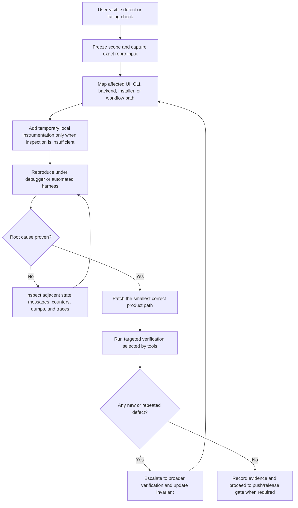

# Debugging Strategy

This document defines the SuperZip debugging workflow for native Windows C++
defects. It is sanitized for repository use: it captures methods and evidence
requirements without carrying external company names, proprietary wording, or
tool-specific marketing language.

## Source Categories Reviewed

The strategy was built from public documentation reviewed on 2026-06-18:

- Native IDE debugger guidance for breakpoints, tracepoints, conditions, data
  breakpoints, and call-stack inspection.
- Native system debugger guidance for live user-mode debugging, crash dumps, and
  time-travel traces.
- Compiler sanitizer guidance for heap, stack, lifetime, and bounds defects.
- Runtime verifier guidance for heap, handle, lock, COM, and API misuse.
- Window/message inspection guidance for Win32 input, drag/drop, focus, and
  command-routing defects.
- Event-tracing guidance for CPU, I/O, GPU, timer, paint, and responsiveness
  investigations.
- Win32 message-queue guidance for mouse, keyboard, wheel, timer, and posted
  application messages.
- Static-analysis and lint guidance for C/C++, scripts, workflow files, and
  build files.
- Crash-dump collection guidance for repeatable local postmortem evidence.

## Principles

- Reproduce first, then patch. A defect is not understood until the failing
  precondition, state transition, and observable result are known.
- Trace the complete path from input event to product outcome. For GUI defects,
  that means hit test, focus state, UI state mutation, worker launch, backend
  call, progress publication, status/history update, and repaint.
- Use targeted checks for ordinary edits and escalate automatically when the
  failure class is broad, stateful, security-sensitive, or repeats after a fix.
- Prefer evidence over intuition. Record the command, input data, expected
  behavior, actual behavior, and artifact path for every confirmed defect.
- Fix root causes. Do not hide findings behind broad exclusions, skipped tests,
  or cosmetic status changes.
- Keep hardware claims explicit. GPU work requires direct telemetry from the AMD
  HIP path; CPU fallback does not count as GPU acceleration evidence.

## Investigation Flow

## GUI Bug Sweep Matrix

Each GUI bug-hunting pass must inspect these paths when the affected area is
near them:

| Area | Required checks |
| --- | --- |
| Queue | Add files, add folders, native file drop, OLE file drop, checkbox toggle, header toggle, column resize, overflow scroll, fixed header, hover tooltip, keyboard focus, Space/Enter activation, empty state, large item counts. |
| Compress | Archive name, destination default, format dropdown, compression level, method, block size, toggles, Start, progress bar, status bar, average throughput, time remaining, output existence, standards compatibility. |
| Extract | Archive field, destination default, archive format display, overwrite policy, integrity/security toggles, Start, progress bar, safe output publication, unsupported archive failure. |
| Security | Empty queue state, selected archive state, Defender opt-in, hash opt-in, Verify, progress bar, status/history/log behavior. |
| System | HIP status, CPU total/dedicated counters, RAM total/dedicated counters, I/O counters, total GPU utilization graph, VRAM total/dedicated rows, refresh interval, axis labels, repaint stability. |
| Settings | Load, draft changes, tab-leave revert, Apply persistence, Restore Defaults, every toggle, every dropdown, log retention pruning. |
| History | Filtering, clear action, row rendering, long text, keyboard traversal. |
| About | Single-source logo rendering, tagline consistency, author/version spacing, keyboard behavior. |

## Native Debugging Checklist

Use the narrowest tool that proves or rejects the hypothesis:

- Breakpoint or tracepoint: prove command routing, state mutation, and worker
  launch without changing product behavior.
- Conditional breakpoint: stop only on specific page, row, format, archive path,
  status text, HRESULT, exception, or worker state.
- Data breakpoint: find unexpected writes to selection, queue enable flags,
  destination paths, progress state, or GPU telemetry fields.
- Message inspection: verify `WM_MOUSEMOVE`, `WM_MOUSEWHEEL`, `WM_DROPFILES`,
  OLE drag/drop, `WM_KEYDOWN`, timers, posted repaint messages, and focus
  behavior.
- Crash dump: preserve postmortem state for non-reproducible termination.
- Sanitizer build: detect memory safety defects in parser, codec, and utility
  code.
- Runtime verifier: detect invalid handles, heap misuse, COM lifetime mistakes,
  lock-order hazards, and invalid API usage.
- Event trace: isolate UI stalls, paint storms, timer drift, disk activity,
  CPU bottlenecks, GPU inactivity, or worker starvation.
- Static analysis: find unsafe lifetime, non-local pointer storage, oversized
  functions, long switches, unchecked return values, and resource leaks.

## Evidence Requirements

Every completed defect fix must leave enough evidence for a later agent to
understand the result:

- Reproduction path or reason the defect could not be reproduced locally.
- Root cause in product terms, not just a code location.
- Exact files changed.
- Targeted local checks run and their result.
- Any skipped check with a concrete reason and follow-up condition.
- Whether final GitHub workflow wait, release replacement, or post-push audit
  is required by the task.

## Regression Rules

- Never add a new UI feature without retesting the existing interactions in the
  same page.
- Never change a visual layer without checking text clipping, hit testing,
  keyboard focus, hover state, and repaint behavior.
- Never change archive output paths without testing explicit destination and
  default destination.
- Never change GPU telemetry without proving whether the value represents total
  system usage, process usage, VRAM usage, or HIP work.
- Never change benchmarks or performance counters in a way that writes large
  generated workloads to storage.
