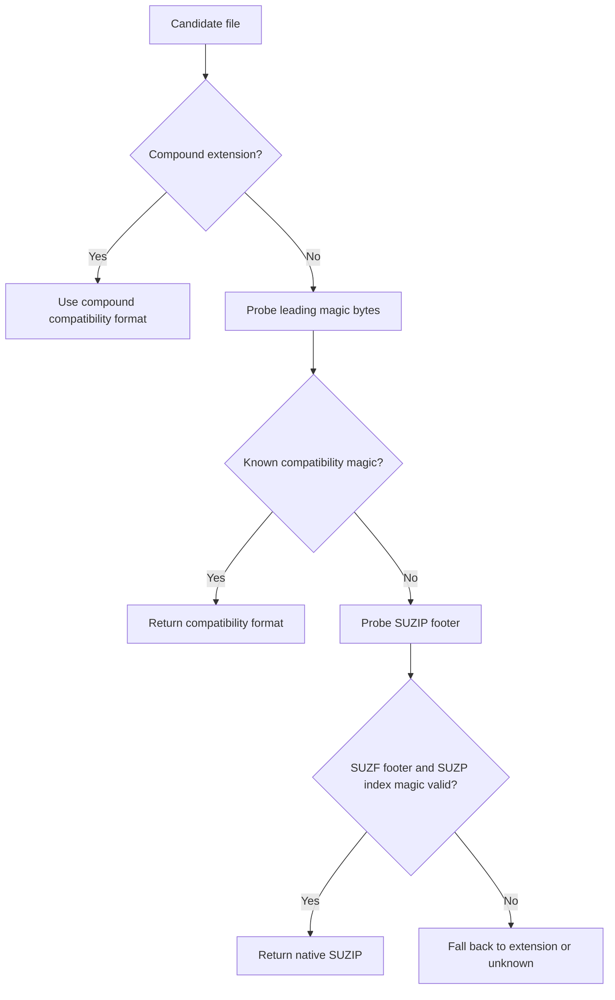

# Native SUZIP Format Contract

SuperZip's `.suzip` format is a native archive format, not a renamed ZIP file.
The extension is the user-facing name for a format that has its own metadata,
footer, block table, GPU boundary, and validation rules.

## Purpose

SUZIP exists because standard ZIP-compatible formats cannot express SuperZip's
AMD HIP block pipeline without hiding non-portable side data or reducing the GPU
path to a compatibility wrapper. The native format keeps those concerns
explicit:

- The index starts with `SUZP` magic and a format version.
- The footer ends the archive with `SUZF` magic, the same version, index offset,
  and index size.
- Each entry records a normalized archive path, directory flag, decoded size,
  payload window, CRC-32, and block descriptors.
- Version 1 block descriptors distinguish raw, deflate, fill, and GPU-pattern
  materialized blocks. Version 2 adds GPU static-prefix blocks for low-entropy
  byte streams.
- Required-GPU operations fail when the archive requires CPU-only block
  handling.
- Extraction and verification validate metadata, payload windows, decoded sizes,
  CRC-32, duplicate paths, path safety, and resource limits before publishing
  output files.

## Detection

Format detection now treats `.suzip` as an extension hint and the footer/index
magic as the native signature. A renamed native archive can be identified by:

1. Reading the final 24-byte footer.
2. Verifying `SUZF` and the current format version.
3. Verifying that the declared index offset and size stay inside the file.
4. Reading the index start and verifying `SUZP`.

The detector does not parse the full index during classification. Full metadata
validation remains in the archive reader so detection stays bounded and
side-effect free.

## Security Rules

- Do not treat SUZIP as a ZIP alias.
- Do not add ZIP container aliases for application packages or documents.
- Do not infer GPU support from the extension alone; use archive metadata and
  operation options.
- Do not accept CPU-only fallback in required-GPU mode.
- Required-GPU `.suzip` compression may emit raw, fill, GPU-pattern, and GPU
  static-prefix blocks. It must not emit CPU-deflate blocks.
- GPU static-prefix blocks are native SUZIP blocks. They are not ZIP, Deflate,
  Zstandard, or a compatibility-format wrapper.
- Keep native-format benchmark claims separate from compatibility-format claims.
- Any future format-version change must add tests for backward detection,
  footer/index validation, corrupt metadata, oversized indexes, and downgrade
  failure behavior.
