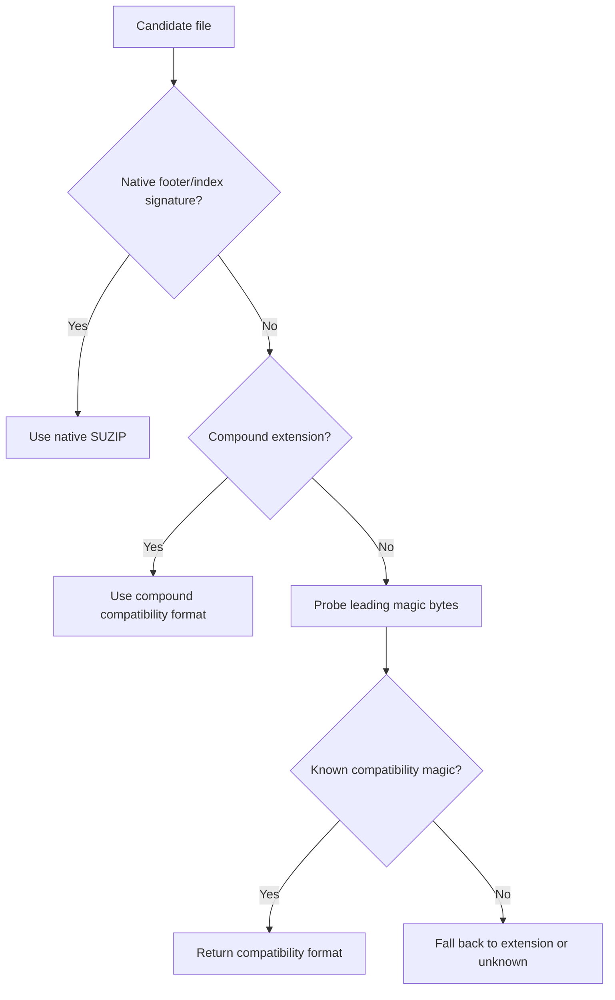

# Native SUZIP Format Contract

SuperZip's `.suzip` format is a native archive format, not a renamed ZIP file.
The extension is the user-facing name for a format that has its own metadata,
footer, block table, GPU boundary, and validation rules.

## Purpose

SUZIP exists because standard ZIP-compatible formats cannot express SuperZip's
AMD HIP block pipeline without hiding non-portable side data or reducing the GPU
path to a compatibility wrapper. The native format keeps those concerns
explicit:

- The index starts with `SUZP` magic and a format version.
- The footer ends the archive with `SUZF` magic, the same version, index offset,
  and index size.
- Each entry records a normalized archive path, directory flag, decoded size,
  payload window, CRC-32, and block descriptors.
- Archive path bytes are UTF-8. Extraction converts them explicitly to native
  Windows paths, independent of the host ANSI code page. This preserves the
  existing index encoding and does not require a format-version change.
- Version 1 block descriptors distinguish raw, deflate, fill, and GPU-pattern
  materialized blocks. Version 2 adds GPU static-prefix blocks for low-entropy
  byte streams. Version 3 adds adaptive GPU-prefix blocks with bounded
  per-block codebooks for stronger required-HIP compression levels. Version 4
  adds GPU dictionary blocks and longer pattern motifs. Version 5 adds GPU
  sparse-pattern blocks. Version 6 adds CPU-only Zstandard frames as block kind
  8. Version 7 adds GPU long-sparse-pattern blocks as kind 9, with motifs
  longer than 16 KiB and at most 1 MiB. Version 8 adds GPU Huffman blocks as
  kind 10. Each Huffman block stores a complete 4096-entry, two-byte-per-entry
  decoder lookup (symbol then code width), followed by the existing 4 KiB
  segment-offset table and packed bitstreams. Codes are read least-significant
  bit first and are at most 12 bits wide. Fully sampled blocks may omit symbols
  absent from the input; every lookup slot must still be covered, and each
  present symbol's leaf must cover its entire prefix range. The reader rejects
  incomplete or conflicting tables and out-of-range offsets before HIP decode.
  Earlier versions remain readable; readers predating each new version reject
  its new block kind.
- Version 9 adds GPU compound blocks as kind 11, created only by Neutron star
  mode. A fixed eight-byte header contains the secondary kind, original kind,
  secondary fill value, a zero reserved byte, and a little-endian 32-bit
  intermediate size. The remaining bytes encode the original codec's payload.
  Decoding applies the secondary codec and then the original codec. Both stages
  are restricted to pattern, static/adaptive prefix, Huffman, dictionary and
  short/long sparse codecs; the secondary stage may also be fill. Raw, CPU
  codecs, unknown kinds and compound stages are rejected. Nesting is therefore
  impossible. Unused fill values must be zero. The complete compound payload
  must be strictly smaller than the intermediate payload, which must itself be
  strictly smaller than the decoded block. All three extents are bounded by
  the native block limit. Existing per-stage framing checks remain mandatory.
  The encoder runs both stages through HIP and preserves the previous winner
  on ties or losses. Required-HIP decoding and CRC verification also execute
  through HIP; the independent CPU reader retains archive compatibility.
  Version-nine decode and Neutron creation admission include an additional
  decoded-window allowance for retained intermediate/trial storage. No
  external dictionary, model or decoder installation is required.
- Entropy encoding compares a bounded nested portfolio of static, adaptive,
  and Huffman candidates by complete measured block payload. It packs only
  winning entropy tables and preserves baseline bytes on ties. Candidate
  search and shared histogram reuse do not change version-three codebooks,
  version-eight lookup layouts, segment offsets, or decoding rules.
- CPU compression evaluates a bounded nested search of independently framed
  Zstandard policies from one through the requested effort for non-fill blocks
  of at least 4 KiB, retaining a corresponding Deflate search for shorter
  blocks. It stores only the smallest complete result smaller than raw, retaining
  earlier frames on ties. Each CPU worker reuses its context and trial storage
  across the assigned block range; losing frames are never serialized. The reader requires one
  complete frame with an exact declared decoded size and rejects trailing
  frames or bytes. Required-HIP decode and verification reject both CPU-only
  compression kinds.
- Required-GPU operations fail when the archive requires CPU-only block
  handling.
- Extraction and verification validate metadata, payload windows, decoded sizes,
  CRC-32, duplicate paths, path safety, and resource limits before publishing
  output files.

## Detection

Small-file GPU submission batching preserves these version-three records and
independent file boundaries. See [the batching contract](small-file-gpu-batching.md)
for its resource limits, byte-identity tests, and measurement scope.

Format detection treats `.suzip` as an extension hint and the footer/index
magic as the stronger native structural signature. Native payload bytes can
begin with another codec's magic, including a version-six Zstandard frame;
the native footer/index signature takes precedence over leading magic and
extension hints. A renamed native archive can be identified by:

1. Reading the final 24-byte footer.
2. Verifying `SUZF` and a supported format version.
3. Verifying that the declared index offset and size stay inside the file.
4. Reading the index start and verifying `SUZP`.

The detector does not parse the full index during classification. Full metadata
validation remains in the archive reader so detection stays bounded and
side-effect free.

```mermaid
flowchart TD
    A["Candidate file"] --> B{"Native footer/index signature?"}
    B -- "Yes" --> C["Use native SUZIP"]
    B -- "No" --> D{"Compound extension?"}
    D -- "Yes" --> E["Use compound compatibility format"]
    D -- "No" --> F["Probe leading magic bytes"]
    F --> G{"Known compatibility magic?"}
    G -- "Yes" --> H["Return compatibility format"]
    G -- "No" --> I["Fall back to extension or unknown"]
```

## Security Rules

- Do not treat SUZIP as a ZIP alias.
- Do not add ZIP container aliases for application packages or documents.
- Do not infer GPU support from the extension alone; use archive metadata and
  operation options.
- Do not accept CPU-only fallback in required-GPU mode.
- Automatic selection may choose CPU before execution for absent HIP or
  CPU-only archive blocks. Once HIP is selected, its errors propagate without
  a CPU retry. Neutron creation always requires HIP. Choosing heap instead of
  pinned host storage does not change the selected codec backend.
- Required-GPU `.suzip` compression may emit raw, fill, GPU-pattern, GPU
  static-prefix, GPU adaptive-prefix, GPU Huffman, GPU dictionary, GPU sparse-pattern, and
  GPU long-sparse-pattern blocks, and Neutron-only GPU compound blocks. It must not emit CPU Deflate or Zstandard
  blocks.
- GPU static-prefix, adaptive-prefix, and Huffman blocks are native SUZIP blocks. They are
  not ZIP, Deflate, Zstandard, or a compatibility-format wrapper.
- Keep native-format benchmark claims separate from compatibility-format claims.
- Any future format-version change must add tests for backward detection,
  footer/index validation, corrupt metadata, oversized indexes, and downgrade
  failure behavior.
