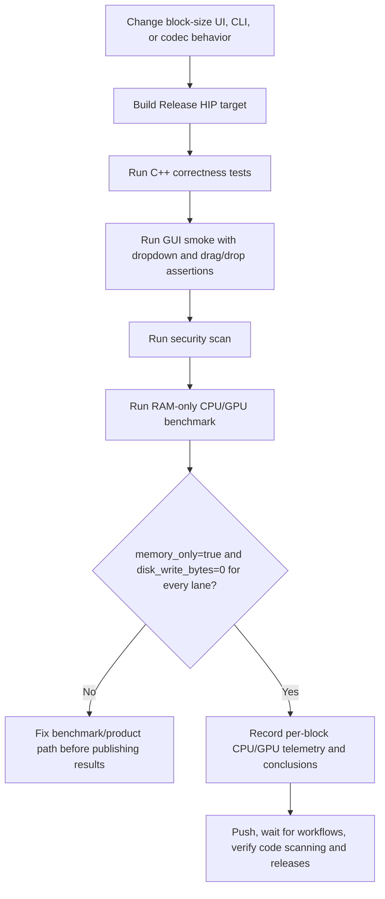
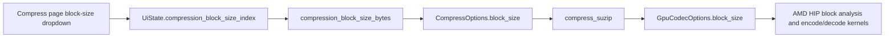

# SuperZip Performance And Block-Size Validation

This document defines how SuperZip performance work is validated without
creating unnecessary SSD wear. It is the operating reference for block-size
changes, CPU/GPU benchmark claims, and the relationship between GUI controls,
CLI arguments, and archive-core resource limits.

## Goals

- Compare forced-CPU and required-AMD-HIP lanes on the same generated data.
- Keep development benchmarks RAM-only for both lanes.
- Exercise every production SUZIP block-size option.
- Compare CPU and GPU at the same compression level and record compression ratio.
- Keep the Mixed profile broad enough to include low-entropy non-pattern data,
  not only fill, repeated text, and random bytes.
- Preserve a tiny filesystem smoke only to prove archive write/read wiring.
- Prevent benchmark-only behavior from diverging from production code paths.

## Production Block Sizes

The supported user-facing block-size choices are:

| UI label | CLI value | Bytes | Intended use |
| --- | ---: | ---: | --- |
| 256 KiB | `--block-size-kib 256` | 262,144 | Smallest latency window and fine-grained metadata validation. |
| 512 KiB | `--block-size-kib 512` | 524,288 | Low-latency option with less metadata overhead than 256 KiB. |
| 1 MiB | `--block-size-kib 1024` | 1,048,576 | Default balanced path. |
| 2 MiB | `--block-size-kib 2048` | 2,097,152 | Mid-sized transfer window for mixed workloads. |
| 4 MiB | `--block-size-kib 4096` | 4,194,304 | Larger transfer window for throughput-focused runs. |
| 8 MiB | `--block-size-kib 8192` | 8,388,608 | High-throughput option below the maximum resource window. |
| 16 MiB | `--block-size-kib 16384` | 16,777,216 | Maximum supported block size under current resource limits. |

Every option must divide the 128 MiB archive chunk size exactly. Values outside
this set are rejected by the CLI benchmark and compression parser.

## Validation Flow



## GUI To Core Path



The GUI smoke must open the block-size dropdown and select an option. Clicking
the control is insufficient; the smoke must capture the expanded menu region so
layout regressions are visible in screenshots.

## Benchmark Command

Use the default RAM-only mode for performance work:

```powershell
tools\bench.ps1 -Configuration Release -SizeMiB 10240 -Profile Mixed -CompressionLevel 5 -Iterations 1 -BlockSizeKiB 256,512,1024,2048,4096,8192,16384
```

Run `Mixed`, `Compressible`, and `Incompressible` profiles before making release
performance claims. The benchmark must compare both lanes unless the task is a
diagnostic that explicitly isolates one lane:

- CPU lane: `--force-cpu`
- GPU lane: `--require-gpu`

The required-GPU lane must fail if HIP is unavailable. A hidden CPU fallback is
not an acceptable benchmark result.

The standard release baseline is compression level 5. Use explicit level sweeps
only when validating compression-strength tradeoffs; do not compare a faster
CPU run at one compression ratio with a GPU run at a different compression
ratio.

## Required Telemetry

Record these fields for every block size:

| Field | Reason |
| --- | --- |
| `InputBytes`, `OutputBytes` | Shows the initial workload size and final archive size directly; ratio-only reporting is not enough for optimization decisions. |
| `CompressMiBs`, `VerifyMiBs`, `ExtractMiBs` | End-to-end archive throughput. |
| `CompressionRatio` | Confirms CPU/GPU speed comparisons use equivalent compression strength. |
| `Workers`, `InflightChunks`, `CodecWorkers` | Confirms production worker allocation. |
| `GpuEncodeChunks`, `GpuDecodeChunks` | Proves the GPU lane processed archive work. |
| `GpuKernelLaunches`, `GpuKernelMs` | Proves HIP kernels were submitted and timed. |
| `GpuH2DMiB`, `GpuD2HMiB`, `GpuAllocMiB` | Confirms device transfer and allocation behavior. |
| `MemoryOnly`, `DiskWriteBytes` | Confirms the benchmark did not write the workload to storage. |
| CPU/GPU utilization samples | Helps interpret whether the bottleneck is host, device, or scheduling. |

## Storage Policy

Large filesystem benchmarks are intentionally excluded from development. They
write generated input, archives, and extracted outputs, which can produce tens
or hundreds of gigabytes of avoidable SSD wear during iterative tuning.

Allowed storage checks:

- `tools\storage_smoke.ps1`, which writes a bounded temporary payload and
  deletes it after SHA-256 comparison.
- `tools\bench.ps1 -Mode Filesystem` only as a capped smoke path of at most
  64 MiB. This mode is not a CPU/GPU performance benchmark.
- A maintainer-requested real-world regression smoke against an existing input
  tree, when the issue cannot be reproduced by the RAM-only benchmark alone.
  Keep it bounded, record input bytes and output bytes, delete temporary
  archives immediately after measurement, and do not treat it as a CPU/GPU
  benchmark or release throughput claim.

Not allowed during development:

- Multi-GB generated filesystem benchmark inputs.
- Treating disk throughput from a smoke path as a release performance claim.
- Reintroducing an override that permits destructive benchmark wear.

## Acceptance Gates

A block-size or performance change is not complete until:

- `tools\build.ps1 -Configuration Release` passes.
- `tools\test.ps1 -Configuration Release` passes, including block metadata
  bounds for every supported block size.
- `tools\gui_smoke.ps1 -Configuration Release` passes and verifies the block
  dropdown, file picker queueing, folder picker queueing, and native drag/drop.
- `tools\security_scan.ps1` passes.
- `tools\bench.ps1` runs in memory mode for all seven block sizes on a HIP host,
  or the result is explicitly recorded as not run with the reason.
- Benchmark records include compression ratio for both CPU and GPU lanes.
- Benchmark records include initial input bytes and final output bytes for every
  lane, in addition to compression ratio.
- No benchmark or test writes a multi-GB generated workload to SSD.
