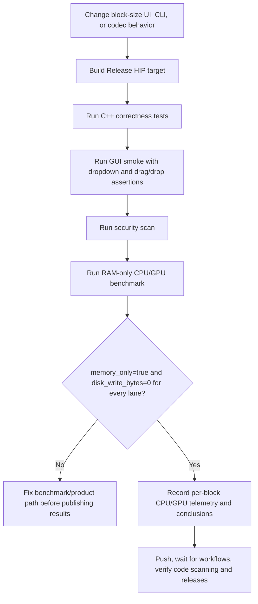
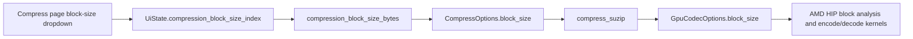

# SuperZip Performance And Block-Size Validation

This document defines how SuperZip performance work is validated without
creating unnecessary SSD wear. It is the operating reference for block-size
changes, CPU/GPU benchmark claims, and the relationship between GUI controls,
CLI arguments, and archive-core resource limits.

## Resource Measurement Contract

New native RAM benchmark records use schema three and identify GPU percentages
as `process_busiest_engine_pct`: the busiest Windows engine for the tested CLI
process, across GPUs. Historical schema-one percentages summed independent
engines and must not be interpreted as Task Manager-style GPU utilization.
Raw historical evidence remains unchanged. The System GUI instead combines
processes using the same physical engine and selects the busiest system engine.
Unavailable or invalid counter data is not replaced with zero or a capped sum.

New runs declare `measurement_protocol=bytewise-regenerated-v2`. After the
normal timed compression, CRC verification and extraction phases in every RAM
window, an independent owned decode compares every byte against regenerated
source for all seven profiles. This validation uses the same backend policy;
required-HIP decoding cannot silently fall back. One decoded chunk and at most
64 worker-local 64 KiB reference buffers are admitted in addition to the normal
reserve. Validation is serial across chunks; decoding and byte comparison use
the admitted worker budget consecutively. Comparison partitions contain at
least 8 MiB, matching the existing parallel CRC grain, with one task on the
calling thread. All asynchronous readers finish before output storage is
released, including on errors. `validation_worker_limit` records the aggregate
budget and must equal `workers`. GPU telemetry is isolated from timed counters.

`validated_bytes` must equal the entire input. `validation_seconds` reports the
extra decode, regeneration, comparison and buffer cleanup; `wall_seconds`
includes it. Product phase times and `seconds` exclude this extra pass.
Validation between windows can affect cache and thermal state, so the graph
validator keeps v2 separate from serial bytewise v1 and historical CRC-only
measurements. Existing v1 records remain readable without inventing parallel
worker metadata. This refinement reduces development validation overhead;
it does not change production codec behavior or establish codec speedups.
Process resource averages span the whole CLI lifetime, including validation;
they are not phase-specific utilization measurements. A CRC collision fixture
checks that the new pass requires byte equality rather than another checksum.

Current records declare
`measurement_identity_policy=native-build-receipt-around-observation-v2`.
The controller requires a successful receipt from `tools/build.ps1` matching
the current native input contents, configured options, CLI, GUI, runtime manifest
and all app-local DLLs. It checks that identity immediately before and after
every observation and at final completion, including runs without JSON output.
Each observation retains receipt/input digests, starting commit, relevant dirty
state and CLI/DLL hashes, plus complete controller `observation_wall_seconds`.
Final JSON embeds the portable receipt once. The complete wall budget includes
receipt validation. Detected changes abort rather than relabeling the cohort,
including another edit in an already dirty checkout. The graph independently
checks the shared receipt schema, canonical digests, measured output hashes and
required-HIP scope, and separates this cohort from historical v1 observation
guards and endpoint-only evidence. Historical records remain readable without
inventing build receipts.

The receipt is local consistency evidence, not authenticated build attestation.
Its Git-visible projection covers native source/tests, CMake, pinned upstream
inputs, compiled resources and build/header-generation helpers. It does not
authenticate ignored or externally substituted inputs, every installed compiler
component, externally loaded HIP runtimes/drivers, or transient changes restored
between checks. The observed CMake MSVC probe and explicitly named critical
compiler/SDK files describe a limited toolchain scope; HIP environment candidates
are not observed compiler versions. See [native build receipts](rocm-toolchain.md#native-build-receipts).
Returned native statistics are journaled before the post-observation check;
if that check fails, raw evidence remains without becoming a valid sample.

Schema three additionally preserves pilot observations, fixed confirmation
plans, all confirmation observations, exact worker/admission geometry and HIP
transfer/allocation counters. Schema-one and schema-two historical records
remain readable without fabricating these new fields. The graph validator
recomputes schema-three safeguards from raw observations instead of trusting
a saved quality label; incompatible or inconclusive records cannot become
publication charts, including with `--allow-dirty`.

Current charts show throughput derived from median elapsed time with the full
observed minimum-to-maximum throughput range. Tooltips disclose sample count
and elapsed-time sample SD. These ranges are not confidence intervals, and
identical observations retain zero-width ranges. Historical charts preserve
their original rendering.

Native comparison rounds alternate CPU/GPU order when both lanes are enabled.
`-InterRunPauseMs` requests a 250 ms pause by default between completed runs,
outside the product timer; accepted values are 0-1000 ms. Records disclose
`lane_order` and `inter_run_pause_ms`. The graph validator keeps different
measurement schemes separate, including older records without these fields.
Review individual phase times for order sensitivity and monotonic slowdown;
repeat affected cases with recorded context before drawing conclusions. A
short pause is not proof of idle resources or absence of thermal drift.

### Scientific Sample Planning

Before the pilot, `memory-benchmark --plan-only` resolves each lane and block's
worker and queue geometry without generating data or reporting fabricated
timing/GPU evidence. The controller freezes encode and decode depths, then
preflights and executes every observation with those exact depths. Production
RAM admission remains enforced: insufficient current headroom aborts the
experiment instead of silently changing its configuration. `-InflightChunks`
can predeclare an exact encode depth; zero selects current admission before
freezing. It is never permission to exceed the host or worker budget.
Configuration or exact-size changes abort at the first detected mismatch,
including between pilot and confirmation; completed samples remain journaled.

The default RAM controller uses a separate, fixed three-observation pilot for
each enabled lane and block size. It then fixes the confirmation count for
each case **before collecting any confirmation observations**. Both lanes
receive the same count. Faster cases get enough planned repeats to reach
30 seconds of measured compress/verify/extract time per lane. For each phase
and the end-to-end total, pilot sample variation also requests
`ceil((100 * sample_sd / mean / target_rse_pct)^2)` observations. The maximum
of the duration request, phase requests and `-Iterations` is used, with a
minimum of three and a default ceiling of 64. The uncapped request and any
ceiling are recorded. These defaults are operational choices, not universal
statistical constants.

Before confirmation, the controller estimates its complete wall workload from
the maximum pilot `observation_wall_seconds` for each lane/case, plus the
configured inter-run pause, multiplied by its frozen confirmation count.
This includes native byte validation and controller preparation/checks, which
are excluded from product phase times. The estimate and remaining suite budget
are journaled; an estimated overrun aborts with pilots retained and requires a
new independently declared run with sufficient time. Counts never shrink to
fit the budget. Observed maxima are not upper bounds or confidence limits;
journal/report overhead and future slower observations can still exhaust the
deadline. The graph validator recomputes the estimate from raw pilots.

`-TargetRelativeStandardErrorPct` defaults to 2. This sample-planning formula
assumes independent observations and is an approximation based on a small
pilot. It is not a confidence interval, significance test or guarantee of
precision. More repetitions reduce an independent mean's standard error;
they do **not** necessarily reduce the underlying coefficient of variation.
Serial correlation, thermal drift, shared-host contention and selection of
the fastest among many candidates require additional controlled experiments
before attributing a change or making a superiority claim.

There is no stop-on-significance or stop-when-variance-looks-good rule during
confirmation. Case order reverses on even rounds and CPU/GPU order alternates;
an odd count has one extra first-position observation for the initial lane.
The pilot is explicitly used for planning and is stored separately, never
silently discarded as warm-up. No observations are trimmed, winsorized or
excluded because of their speed. Mean, median, minimum, maximum, sample SD
(denominator `n - 1`), CV and the independence-assuming RSE diagnostic describe
the **whole** confirmation sample. A single observation has unavailable SD,
not zero uncertainty. Pilot and confirmation are not pooled after sample
size selection.

A confirmation remains inconclusive if any phase or total exceeds
`-MaxRelativeStdDevPct` (default 5), the planned precision diagnostic or
duration floor is missed, resources or exact sizes change, or required
resource counters are unavailable. A stable descriptive result still carries
no confidence or statistical-significance claim. The displayed CPU/GPU mean
time ratio is an observation, with archive sizes reported separately.
`-FixedIterations` explicitly bypasses the pilot and prescribes exactly
`-Iterations` confirmation observations; a one-run diagnostic stays
inconclusive. Neither mode replaces controlled before/after comparisons.

An exclusively created JSONL journal records the protocol, frozen plan,
every completed observation and terminal sample failures. It is retained
even without `-JsonOutput` under ignored `out/benchmark-samples`. With
`-JsonOutput`, its name is the final JSON path plus `.samples.jsonl`.
Correctness, subprocess and deadline failures abort instead of silently
retrying or skipping the failed observation; no completed publication record
is created. `-RunTimeoutSeconds` defaults to 300 and
`-SuiteTimeoutSeconds` to 3600. Suite exhaustion is checked between samples;
an already admitted sample can finish within its run deadline. Only the
owned CLI is terminated, with a five-second termination wait. These limits
do not promise cancellation of a stalled GPU driver or unrelated host work.
Each redirected pipe is limited to 65,536 characters and excess output
fails rather than being silently truncated. Journal/JSON writes are small
diagnostic metadata; `disk_write_bytes=0` refers to archive/workload writes.

The design follows the measurement practices in the
[Google Benchmark user guide](https://google.github.io/benchmark/user_guide.html),
[pyperf analysis documentation](https://pyperf.readthedocs.io/en/latest/analyze.html)
and [NIST measures of scale](https://www.itl.nist.gov/div898/handbook/eda/section3/eda356.htm),
checked on 2026-10-02. It does not import their implementations or use
outlier removal to obtain a preferred result.

## Goals

- Compare forced-CPU and required-AMD-HIP lanes on the same generated data.
- Keep development benchmarks RAM-only for both lanes.
- Exercise every production SUZIP block-size option.
- Compare CPU and GPU at the same compression level and record compression ratio.
- Keep the Mixed profile broad enough to include low-entropy non-pattern data,
  not only fill, repeated text, and random bytes.
- Preserve a tiny filesystem smoke only to prove archive write/read wiring.
- Prevent benchmark-only behavior from diverging from production code paths.

## Production Block Sizes

The supported user-facing block-size choices are:

| UI label | CLI value | Bytes | Intended use |
| --- | ---: | ---: | --- |
| 256 KiB | `--block-size-kib 256` | 262,144 | Smallest latency window and fine-grained metadata validation. |
| 512 KiB | `--block-size-kib 512` | 524,288 | Low-latency option with less metadata overhead than 256 KiB. |
| 1 MiB | `--block-size-kib 1024` | 1,048,576 | Lower-latency explicit option; saved GUI selections retain this value. |
| 2 MiB | `--block-size-kib 2048` | 2,097,152 | Mid-sized transfer window for mixed workloads. |
| 4 MiB | `--block-size-kib 4096` | 4,194,304 | Larger transfer window for throughput-focused runs. |
| 8 MiB | `--block-size-kib 8192` | 8,388,608 | Default; preserves the option index of older saved selections. |
| 16 MiB | `--block-size-kib 16384` | 16,777,216 | Maximum supported block size under current resource limits. |

Every option must divide the 128 MiB archive chunk size exactly. Values outside
this set are rejected by the CLI benchmark and compression parser.

## Validation Flow


```mermaid
flowchart TD
    A["Change block-size UI, CLI, or codec behavior"] --> B["Build Release HIP target"]
    B --> C["Run C++ correctness tests"]
    C --> D["Run GUI smoke with dropdown and drag/drop assertions"]
    D --> E["Run security scan"]
    E --> F["Run RAM-only CPU/GPU benchmark"]
    F --> G{"memory_only=true and disk_write_bytes=0 for every lane?"}
    G -- "No" --> H["Fix benchmark/product path before publishing results"]
    G -- "Yes" --> I["Record per-block CPU/GPU telemetry and conclusions"]
    I --> J["Push, wait for workflows, verify code scanning and releases"]
```

## GUI To Core Path


```mermaid
flowchart LR
    UI["Compress page block-size dropdown"] --> State["UiState.compression_block_size_index"]
    State --> Map["compression_block_size_bytes"]
    Map --> Options["CompressOptions.block_size"]
    Options --> Core["compress_suzip"]
    Core --> Codec["GpuCodecOptions.block_size"]
    Codec --> HIP["AMD HIP block analysis and encode/decode kernels"]
```

The GUI smoke must open the block-size dropdown and select an option. Clicking
the control is insufficient; the smoke must capture the expanded menu region so
layout regressions are visible in screenshots.

## Benchmark Command

Use the default RAM-only mode for performance work:

```powershell
tools\bench.ps1 -Configuration Release -SizeMiB 10240 -Profile Mixed -CompressionLevel 5 -Iterations 1 -BlockSizeKiB 256,512,1024,2048,4096,8192,16384
```

Run `Mixed`, `Compressible`, and `Incompressible` profiles before making release
performance claims. The benchmark must compare both lanes unless the task is a
diagnostic that explicitly isolates one lane:

- CPU lane: `--force-cpu`
- GPU lane: `--require-gpu`

The required-GPU lane must fail if HIP is unavailable. A hidden CPU fallback is
not an acceptable benchmark result.

The standard release baseline is compression level 5. Use explicit level sweeps
only when validating compression-strength tradeoffs; do not compare a faster
CPU run at one compression ratio with a GPU run at a different compression
ratio.

## Required Telemetry

On a shared development host, timing requires representative headroom, not a
perfectly idle machine. Record concurrent CPU/GPU load, available RAM, and disk
activity before and during a run, without modifying unrelated processes.
Sustained saturation, paging, storage queues, or substantial repeat-to-repeat
variation make timing inconclusive. Modest stable background use is acceptable.
Treat small differences within measured repeat-to-repeat variation as
inconclusive, not automatic grounds to reject an optimization. Repeat in
alternating order when results overlap. Prioritize opportunities for multi-fold
end-to-end gains over tuning noise; require byte-exact correctness and unchanged
format contracts before interpreting throughput. A local rejection does not
rule out a different implementation or hardware configuration.
Builds and correctness tests need not wait for a timing window. Compression
sizes and byte-exact roundtrip results remain valid independently of timing.

Per-process summed GPU engine percentages and accumulated concurrent HIP kernel
time are not total-device utilization percentages; either can exceed 100.
Do not compare those values directly to Task Manager's busiest-engine display.

HIP event timing is not assumed valid merely because the runtime call succeeds.
Negative, non-finite, unrepresentable, or overflowing elapsed-time totals are
reported as `gpu_kernel_ms=nan` (or `diagnostic_kernel_ms=nan`), never wrapped
integer values or fabricated zero durations. Launch and transfer counters
remain available, and archive work does not fail solely because timing is
invalid. The unavailable marker survives concurrent accumulation, successful
attempt merges, and operation-total aggregation. Benchmark readers retain it
as unavailable and reject it as HIP timing evidence. This does not identify
the cause of an invalid device clock or establish performance improvements.

Owned-output decoding records allocation, decoded-byte materialization and host
CRC intervals through the same production path for CPU and GPU execution. The
RAM result adds `owned_decode_stage_worker_seconds` with `allocation`,
`materialization` and `crc` fields. These are summed concurrent host-observed
worker intervals, not HIP event durations, wall-clock phase fractions or a
critical-path breakdown. Materialization includes the backend work and waits
inside `decode_chunk`; it does not isolate transfers from kernels. In the RAM
benchmark, owned-output decoding occurs during extraction, while aggregate HIP
kernel and transfer counters also include compression and verification.

Worker timing uses the same sticky unavailable-on-overflow contract as kernel
timing. The benchmark reporter rejects missing, extra, negative or non-finite
stage values. Historical records without these additive schema-two fields do
not provide stage evidence; never fill missing timings with fabricated zeros.
Single-repeat stage diagnostics can select the next profiling target, but cannot
establish a speedup, stability trend or release-ready comparison.

The October 2 single-allocation workspace experiment did not establish a
general decode improvement and is not production code. A preserved baseline,
initial packed layout, aligned correction and return-to-baseline check covered
16 RAM-only diagnostic runs. Mixed verification remained slower after the
alignment correction, while extraction ranges overlapped. The allocation count
alone was insufficient evidence of a benefit. Allocation placement, transfer,
materialization, resident CRC and cleanup still need separate phase evidence;
do not attribute the result to an unmeasured device or runtime mechanism.
These diagnostics are not final comparison graphs or release throughput claims.

HIP device-memory plans now use independent, synchronized accounting for each
runtime device ordinal. The acquired identity survives reservation moves and
cleanup; no device is selected implicitly. The existing free-memory guard and
capacity epoch remain in place for each adapter, and idle ledger entries are
removed. Synthetic tests cover unequal capacities, concurrent same-device
admission, pressure, invalid counters, overflow and release errors without
allocating that VRAM. This is not multi-device hardware validation or complete
process-memory containment. AMD notes that
[Windows HIP memory counters](https://rocm.docs.amd.com/projects/HIP/en/latest/doxygen/html/group___memory.html)
may account only for allocations in the current process; neither a snapshot
nor this ledger reserves physical memory against other applications.

### Dispatch-Bound Timing (2026-09-08)

Production codec and diagnostic launches now attach their start/stop events
directly through HIP's `hipExtLaunchKernel` API. A shared helper derives the
argument storage types from the kernel signature, checks the dispatch result,
preserves the existing per-thread stream and ordered-launch flags, and retains
stop-event synchronization before reading results or releasing device memory.
This changes instrumentation, not kernel algorithms or archive bytes.

A standalone HIP 7.1 probe on the available gfx1201 device compared identical
deterministic kernels with separate event markers versus dispatch-bound events.
Four runs alternated the two methods on per-thread and explicit nonblocking
streams, with 16,384 and 1,048,576 output words. All API calls and independent
CPU output checks passed. Of 1,600 marker measurements, 128 were negative;
all 1,600 dispatch-bound measurements were finite and positive. This isolates
the marker-timing failure outside SuperZip but does not establish whether the
underlying fault belongs to the installed runtime or driver.

Production regression coverage adds four concurrent HIP callers, fill,
pattern, static/adaptive prefix and raw data, short tails, independent-block
CRCs, decoded CRCs, CPU/HIP roundtrips, and diagnostic compute/checksum kernels.
All 385 native tests passed on the available device. Other release GPU targets
are compile-validated, not hardware-tested. The experimental dictionary
pipeline's multi-kernel timing intervals are not changed by this checkpoint.

Invalid-duration propagation and benchmark rejection remain unchanged. Do not
compare these dispatch durations directly with historical marker intervals,
which can include different scheduling overhead. This is not a speedup claim;
the standard timing sweep still needs a representative shared-host window.

Record these fields for every block size:

| Field | Reason |
| --- | --- |
| `InputBytes`, `OutputBytes` | Shows the initial workload size and final archive size directly; ratio-only reporting is not enough for optimization decisions. |
| `CompressMiBs`, `VerifyMiBs`, `ExtractMiBs` | End-to-end archive throughput. |
| `CompressionRatio` | Confirms CPU/GPU speed comparisons use equivalent compression strength. |
| `Workers`, `InflightChunks`, `CodecWorkers` | Confirms production worker allocation. |
| `DecodeInflightChunks`, `DecodeCodecWorkers` | Separates extraction admission/checksum workers from the encoder and verifier queue. |
| `OwnedDecodeStages` | Separates owned-output allocation, materialization and host CRC as summed worker intervals for either backend, not elapsed phase times. |
| `GpuEncodeChunks`, `GpuDecodeChunks` | Proves the GPU lane processed archive work. |
| `GpuKernelLaunches`, `GpuKernelMs` | Proves HIP kernels were submitted and timed. |
| `GpuH2DMiB`, `GpuD2HMiB`, `GpuAllocMiB` | Confirms device transfer and allocation behavior. |
| `GpuHostPinnedAllocMiB`, `GpuHostPinnedOutputMiB` | Separates fresh pinned host extents from all output processed through them, including reuse; neither is live RAM or VRAM. |
| `MemoryOnly`, `DiskWriteBytes` | Confirms the benchmark did not write the workload to storage. |
| CPU/GPU utilization samples | Helps interpret whether the bottleneck is host, device, or scheduling. |

The owned-output [development checkpoint](benchmarks/2026-10-01-pinned-output-pool.md)
records the bounded pin policy, production/RAM path parity, and matched
extraction measurements. Its new schema-two fields are additive. Historical
records without decoder counters retain unavailable values; do not infer their
queue depth from the requested worker count. Pinned allocation/output counters
count successful owned decodes, not every attempted HIP allocation. RAM
reconstruction in those historical measurements is checked by CRC; their
separate byte-comparison fixtures are not an interchangeable benchmark claim.
The current independent benchmark validation pass is documented above.

### Per-Block Adaptive Selection (2026-09-05)

The adaptive encoder now compares each candidate against that block's existing
static/raw representation before packing. It retains smaller static blocks in
mixed chunks and does not transfer losing adaptive payloads. The native format
and GPU kernels are unchanged in this checkpoint.

Three alternating old/new repetitions at levels 5 and 9 used the Mixed 10 GiB
RAM-only workload, four workers, and 1 MiB blocks on an RX 9070 XT. All 12 runs
produced 4,570,658,964 bytes and passed roundtrip verification. At level 9,
mean compression time changed from 9.1101 to 8.6601 seconds; total operation
time changed from 18.2572 to 17.9439 seconds with overlapping run ranges.
Kernel launches decreased from 420 to 400, and device-to-host bytes decreased
from 14,517,430,568 to 12,633,988,244. The unchanged level-5 path's small timing
movement is inconclusive. These are modest improvements, not multi-fold gains
or a solution to the two-tier effort limitation.

Concurrent A/B samples recorded CPU utilization up to 37.7%, at least 31,042 MiB
available RAM, disk activity up to 37.2%, and a maximum sampled individual GPU
engine utilization of 64.6%. Invalid dynamic-counter instances were unavailable,
not zero. These observations do not establish an entirely idle host.

The subsequent standard level-5 sweep passed all seven block sizes in both
CPU and required-HIP lanes: 14 runs, each with 10,737,418,240 input bytes,
`memory_only=true`, and `disk_write_bytes=0`. This sweep validates production
block-size coverage, not an old/new speedup. The 306-test native suite and full
GUI smoke also passed. Dedicated security review remains explicitly deferred;
this checkpoint is not release-wide performance or security certification.

### Register Word-Packing Experiment (2026-09-05)

A register-buffer rewrite of both prefix packers passed independent bit-exact
reference tests, but did not demonstrate the requested substantial improvement.
It was removed; the reference tests remain. The comparison used the same Mixed
10 GiB required-HIP workload, four workers, 1 MiB blocks, and three alternating
old/new repetitions at each of levels 5 and 9. All 12 runs produced
4,570,658,964 bytes with verified roundtrips, RAM-only mode, and no workload
disk writes. Level-9 mean compression time was 8.5681 seconds before and
8.5242 after; level-5 times varied from 8.0679 to 9.5573 seconds across both
binaries. Neither establishes a substantial end-to-end benefit.

Shared-host samples showed CPU up to 36.7%, at least 31,509 MiB available RAM,
disk activity up to 3.7%, and individual GPU engine utilization up to 67.3%.
Timing variation remains inconclusive, not proof that all related approaches
are slower. Do not repeat this candidate without new profiling evidence.

## Storage Policy

### Rejected Prefix Scheduling Experiment (2026-09-05)

A candidate packed independent 4 KiB prefix decode segments into 128-thread
blocks instead of the existing one-thread blocks. Correctness passed for static
and adaptive prefix data, including one segment, uneven segment counts, and
partial final segments. The candidate nevertheless regressed the production
RAM-only pipeline and was removed. The boundary regression test remains.

The A/B comparison used preserved Release binaries, AMD Radeon RX 9070 XT,
10,737,418,240 input bytes, Mixed profile, required HIP, four workers,
1 MiB blocks, and three repetitions per binary and compression level. Run order
alternated old/new and new/old. All 12 runs produced 4,570,658,964 output bytes
(ratio 0.425676), validated roundtrips, and reported `memory_only=true` and
`disk_write_bytes=0`.

| Level | Existing mean total seconds | Candidate mean total seconds | Existing mean verify seconds | Candidate mean verify seconds |
| --- | --- | --- | --- | --- |
| 5 | 17.219 | 18.584 | 1.517 | 2.155 |
| 9 | 17.982 | 19.614 | 1.517 | 2.308 |

Pre-run samples showed 1.7-8.0% CPU, about 29 GiB available RAM, low paging and
disk activity, and no individual GPU engine above 5%. During-run spot samples
showed other GPU activity, so this is a local rejection decision, not a universal
hardware claim. The consistent repeated regression is sufficient not to ship
the candidate. More active lanes alone do not establish a faster kernel;
instruction divergence, memory access, and end-to-end effects require profiling.

Large filesystem benchmarks are intentionally excluded from development. They
write generated input, archives, and extracted outputs, which can produce tens
or hundreds of gigabytes of avoidable SSD wear during iterative tuning.

Allowed storage checks:

- `tools\storage_smoke.ps1`, which writes a bounded temporary payload and
  deletes it after SHA-256 comparison.
- `tools\bench.ps1 -Mode Filesystem` only as a capped smoke path of at most
  64 MiB. This mode is not a CPU/GPU performance benchmark.
- A maintainer-requested real-world regression smoke against an existing input
  tree, when the issue cannot be reproduced by the RAM-only benchmark alone.
  Keep it bounded, record input bytes and output bytes, delete temporary
  archives immediately after measurement, and do not treat it as a CPU/GPU
  benchmark or release throughput claim.

Not allowed during development:

- Multi-GB generated filesystem benchmark inputs.
- Treating disk throughput from a smoke path as a release performance claim.
- Reintroducing an override that permits destructive benchmark wear.

## Acceptance Gates

The October Mixed study and its failed-export recovery are recorded in
[round nineteen of the modernization audit](modernization-audit-2026-10-02.md#round-nineteen-completed-measurements-and-report-export-repair).
Its full raw journal is retained; three larger-block GPU cases remain
inconclusive. Compression phase time includes generated-source preparation
inside owned encode tasks. Generation and encoding worker totals overlap, so
they must not be subtracted from elapsed wall time or presented as phase shares.
Independent bytewise validation and controller costs are separately recorded.

A block-size or performance change is not complete until:

- `tools\build.ps1 -Configuration Release` passes.
- `tools\test.ps1 -Configuration Release` passes, including block metadata
  bounds for every supported block size.
- `tools\gui_smoke.ps1 -Configuration Release` passes and verifies the block
  dropdown, file picker queueing, folder picker queueing, and native drag/drop.
- `tools\security_scan.ps1` passes.
- `tools\bench.ps1` runs in memory mode for all seven block sizes on a HIP host,
  or the result is explicitly recorded as not run with the reason.
- Benchmark records include compression ratio for both CPU and GPU lanes.
- Benchmark records include initial input bytes and final output bytes for every
  lane, in addition to compression ratio.
- No benchmark or test writes a multi-GB generated workload to SSD.
