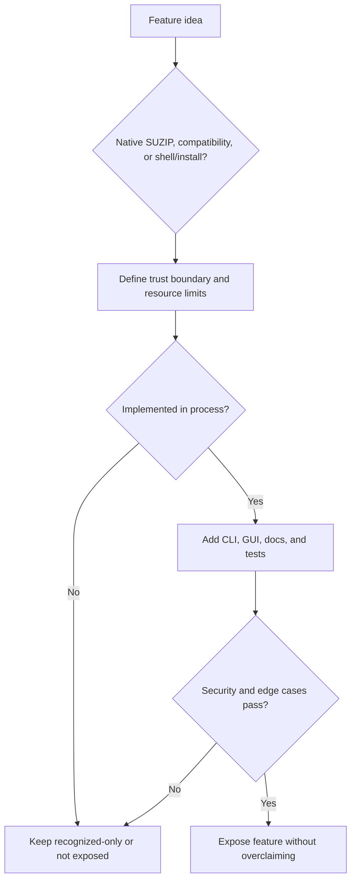

# Product Behavior Audit Checklist

Checked on 2026-06-17 against an official help corpus from a mature Windows
archive application. The reviewed section contained 66 same-site help pages,
and every page fetched successfully. The external product name, URLs, and page
text are intentionally not recorded here. This document captures only
product-quality logic that is useful for SuperZip.

## Audit Coverage

The reviewed help corpus clustered into:

- Format behavior, including modern and legacy archive families.
- Performance behavior, including multi-core compression, parallel extraction,
  high-speed archive updates, drag-and-drop workflows, and files held open by
  other processes.
- Security and integrity behavior, including malware scanning, archive testing,
  corruption prevention, password/encryption boundaries, and metadata copied
  from downloaded files.
- Installer, shell, command-line, update, and uninstall behavior.
- Workflow ergonomics, including preview, direct open, direct edit, custom names,
  settings import/export, tree expansion, and theme controls.
- Troubleshooting behavior, including slow jobs, split archives, mapped drives,
  icon registration, context menus, setup parameters, and generic parameter
  errors.

## Capability Planning Lessons

- Features that change user data need a create, extract, verify, rollback, and
  troubleshooting story before they become visible in the GUI.
- Destination selection is product logic, not a cosmetic detail. "Extract here"
  style commands need a deterministic folder policy for single-file archives,
  archives already rooted in one top-level directory, mixed-root archives, name
  collisions, and existing destination directories.
- Drag/drop and shell-entry workflows need parity with in-app workflows. A file
  added by drag/drop, picker, context menu, or command line must land in the
  same queue model and reach the same security validation before work starts.
- Archive mutation is a separate product surface from archive creation and
  extraction. Direct edit, delete, rename, and in-place update flows require
  temporary backups, atomic publication, and corruption recovery tests.
- Preview and open-with flows must not bypass extraction safety. Any temporary
  preview output needs the same path validation, overwrite policy, cleanup, and
  optional malware scan path as normal extraction.
- Split archives need explicit part discovery, ordering, size limits, missing
  part diagnostics, and a safe failure mode before extraction support is
  advertised.
- Solid compression and multi-file block grouping must be explained and tested
  as an accessibility tradeoff. Better ratios can make random access slower and
  corruption impact larger, so block size, recovery behavior, and partial
  extraction cost need evidence before a default changes.
- Unicode filename handling must be format-specific. ZIP UTF-8 flags, Unicode
  path extra fields, legacy code pages, TAR UTF-8 names, and non-ASCII password
  input are separate compatibility paths with separate tests.
- Password handling needs clear boundaries: encryption, filename encryption,
  password storage, recovery, and non-ASCII password input are separate
  features with separate threat models.
- Shell integration is not just menu registration. File associations, context
  menus, drag/drop behavior, icon refresh, installer repair, uninstall cleanup,
  and default-app conflicts each need smoke tests.
- Performance features must be tied to evidence. Multi-core compression,
  parallel extraction, high-speed archive updates, and GPU acceleration need
  benchmarks that report data size, compression level, block size, ratio,
  memory mode, CPU/GPU lane, and resource sampling interval.
- "Skip recompression for already-compressed data" is a performance policy, not
  a shortcut. It must be based on deterministic sampling, must not weaken
  integrity verification, and must still report the chosen method in benchmark
  and operation history output.
- Parallel extraction must be format-aware. Some codecs and archive layouts are
  inherently serial, while others can parallelize independent members or blocks;
  the scheduler should expose this distinction instead of claiming universal
  saturation.
- Troubleshooting text should map directly to a diagnostic command or UI state.
  Examples include unsupported archive method, missing HIP runtime, missing
  driver, unavailable destination, locked file, mapped-drive failure, invalid
  code page, and corrupt split set.

## SuperZip Decisions

- GPU acceleration is a native SUZIP capability. Compatibility formats must not
  imply GPU acceleration unless their production implementation actually uses
  the AMD HIP path and tests prove it.
- Unsupported convenience features must fail clearly instead of being implied by
  UI text, file association, or documentation. This includes archive repair,
  password recovery, split-set extraction, direct edit-in-archive, shell
  extension behavior, and locked-file compression unless the feature is built
  and tested.
- Create, extract, verify, benchmark, install, uninstall, and CLI paths need
  explicit tests. A working GUI path does not replace scriptable validation.
- Security-sensitive options remain explicit opt-ins. Defender scanning,
  integrity hashing, overwrite, and any future password handling must be visible
  choices rather than silent behavior.
- Archive testing is a first-class behavior: format parsers need corrupt input,
  truncation, oversized metadata, unsafe path, duplicate path, and overwrite
  refusal tests.
- Format support must be described by actual backend capability, not by file
  extension familiarity. A format may be recognized, extract-only, create-only,
  or fully supported; documentation and UI labels must preserve that distinction.
- Single-file encodings and compression streams must not be presented as
  multi-entry archives. Their output filename policy, integrity limitations, and
  overwrite behavior need to be explicit.
- Compound stream wrappers need explicit routing before generic single-stream
  handlers. Examples include archive formats carried through compression filters
  where the inner archive, not the outer filter, defines multi-entry behavior.
- Split archives, package containers, self-extracting wrappers, and shell
  integrations require separate security policies before they become visible
  product features.
- Troubleshooting output should be actionable: slow performance, unavailable AMD
  HIP, missing driver runtime, filesystem access failures, mapped-drive issues,
  installer privilege requirements, and unsupported split archives should have
  direct diagnostics.
- Install and uninstall behavior must be clean and testable. Product releases
  remain Windows x64, HIP-enabled, per-machine by default, and removable without
  leaving app-owned files or registry state behind.

## Required Test Signals

- Each visible GUI workflow must have at least one automated smoke path and at
  least one screenshot reviewed after layout changes.
- Every supported extraction backend needs parser tests for empty input,
  truncated input, malformed headers, oversized metadata, unsafe paths,
  duplicate paths, unsupported methods, and corrupt payload checksums when the
  format provides them.
- Every compatibility feature must have CLI coverage because CLI tests are the
  repeatable contract used by CI and future agents.
- Installer changes must validate both the default elevated product path and
  the non-admin development path. Release artifacts must stay HIP-enabled.
- Documentation must distinguish supported, extract-only, recognized-only, and
  explicitly unsupported behavior. Do not let marketing-style wording outrun the
  actual backend.

## Regression Gate

When adding a feature that appears in a mature archive application, apply this
gate before exposing it in SuperZip:

Do not copy another product's terminology or behavior blindly. SuperZip's
native differentiator is AMD-only HIP acceleration, and its enterprise baseline
is explicit behavior, bounded resources, and verifiable security properties.
