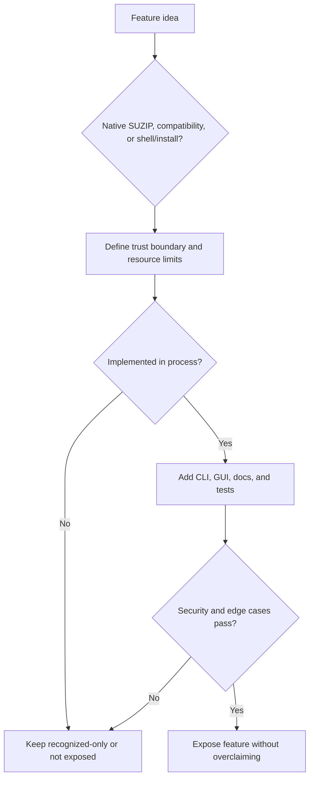

# Product Behavior Audit Checklist

Checked on 2026-06-16 against an official help corpus from a mature Windows
archive application. The external product name and page text are intentionally
not recorded here. This document captures only product-quality logic that is
useful for SuperZip.

## Audit Coverage

The reviewed help corpus covered 77 same-site pages. The topics clustered into:

- Format behavior, including modern and legacy archive families.
- Performance behavior, including multi-core compression, parallel extraction,
  high-speed archive updates, drag-and-drop workflows, and files held open by
  other processes.
- Security and integrity behavior, including malware scanning, archive testing,
  corruption prevention, password/encryption boundaries, and metadata copied
  from downloaded files.
- Installer, shell, command-line, update, and uninstall behavior.
- Workflow ergonomics, including preview, direct open, direct edit, custom names,
  settings import/export, tree expansion, and theme controls.
- Troubleshooting behavior, including slow jobs, split archives, mapped drives,
  icon registration, context menus, setup parameters, and generic parameter
  errors.

## SuperZip Decisions

- GPU acceleration is a native SUZIP capability. Compatibility formats must not
  imply GPU acceleration unless their production implementation actually uses
  the AMD HIP path and tests prove it.
- Unsupported convenience features must fail clearly instead of being implied by
  UI text, file association, or documentation. This includes archive repair,
  password recovery, split-set extraction, direct edit-in-archive, shell
  extension behavior, and locked-file compression unless the feature is built
  and tested.
- Create, extract, verify, benchmark, install, uninstall, and CLI paths need
  explicit tests. A working GUI path does not replace scriptable validation.
- Security-sensitive options remain explicit opt-ins. Defender scanning,
  integrity hashing, overwrite, and any future password handling must be visible
  choices rather than silent behavior.
- Archive testing is a first-class behavior: format parsers need corrupt input,
  truncation, oversized metadata, unsafe path, duplicate path, and overwrite
  refusal tests.
- Format support must be described by actual backend capability, not by file
  extension familiarity. A format may be recognized, extract-only, create-only,
  or fully supported; documentation and UI labels must preserve that distinction.
- Single-file encodings and compression streams must not be presented as
  multi-entry archives. Their output filename policy, integrity limitations, and
  overwrite behavior need to be explicit.
- Split archives, package containers, self-extracting wrappers, and shell
  integrations require separate security policies before they become visible
  product features.
- Troubleshooting output should be actionable: slow performance, unavailable AMD
  HIP, missing driver runtime, filesystem access failures, mapped-drive issues,
  installer privilege requirements, and unsupported split archives should have
  direct diagnostics.
- Install and uninstall behavior must be clean and testable. Product releases
  remain Windows x64, HIP-enabled, per-machine by default, and removable without
  leaving app-owned files or registry state behind.

## Regression Gate

When adding a feature that appears in a mature archive application, apply this
gate before exposing it in SuperZip:

Do not copy another product's terminology or behavior blindly. SuperZip's
native differentiator is AMD-only HIP acceleration, and its enterprise baseline
is explicit behavior, bounded resources, and verifiable security properties.
