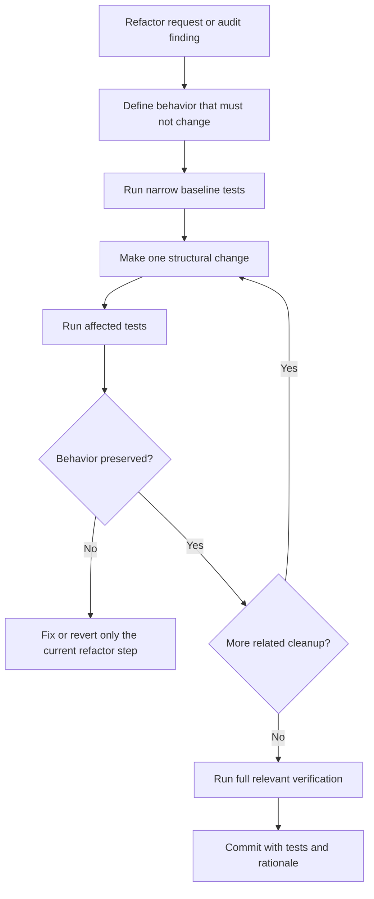

# Refactoring Governance

This document defines how SuperZip refactoring is planned, triggered, executed,
and verified without changing product behavior accidentally.

## References Checked

Checked on 2026-06-16:

- Martin Fowler, Refactoring: <https://refactoring.com/>
- Google Engineering Practices, Small CLs: <https://google.github.io/eng-practices/review/developer/small-cls.html>
- Microsoft Visual Studio refactoring documentation: <https://learn.microsoft.com/en-us/visualstudio/ide/refactoring-in-visual-studio>
- NIST Secure Software Development Framework SP 800-218: <https://csrc.nist.gov/pubs/sp/800/218/final>
- CISA Secure by Design: <https://www.cisa.gov/securebydesign>
- OWASP Secure Coding Practices Quick Reference Guide: <https://owasp.org/www-project-secure-coding-practices-quick-reference-guide/>
- GitHub Actions secure use: <https://docs.github.com/actions/security-guides/security-hardening-for-github-actions>
- OpenSSF Scorecard checks: <https://github.com/ossf/scorecard>
- SLSA specification v1.2: <https://slsa.dev/spec/v1.2/>

The common rule is that refactoring changes structure while preserving behavior.
For SuperZip, that means tests, benchmark baselines, and security gates are part
of the refactor itself, not a cleanup step after the fact.

## Trigger Policy

Refactoring may start in two ways:

- User-requested: a maintainer explicitly asks for cleanup, architecture work,
  readability work, or performance-neutral restructuring.
- Audit-triggered: `tools\refactor_audit.ps1` reports files or functions that
  cross the repo thresholds and the agent or maintainer decides the change is
  worth the risk.

Automatic audit-triggered refactoring must not silently land broad changes.
The automation produces findings and a plan; code edits still need tests and a
normal reviewable commit.

Changed code is held to a stricter gate than the historical backlog. The
repository still contains known large legacy surfaces, especially the native
Win32 UI shell, so the full audit remains a planning tool. New or modified
functions must pass the changed-code gate before push:

```powershell
tools\refactor_audit.ps1 -ChangedOnly -CheckContracts -MaxFunctionLines 120 -MaxComplexityMarkers 35 -FailOnFindings
```

This gate is intentionally wired into `tools\security_scan.ps1` so large or
poorly documented functions are caught locally before CodeQL reports them after
push. Do not bypass it with exclusions; split the changed function or add the
required function contract.

## Workflow



## Refactoring Rules

- Keep functional changes separate from structural cleanup unless one cannot be
  tested without the other.
- Prefer smaller commits and smaller pull requests.
- Preserve public CLI output unless the change explicitly updates a documented
  contract.
- Preserve archive compatibility, path-safety behavior, Defender opt-in
  behavior, and AMD HIP required-GPU failure behavior.
- Measure performance before and after when touching hot paths, worker
  allocation, memory buffers, or GPU codec code.
- Do not replace clear code with an abstraction unless it removes real
  duplication, narrows ownership, or improves testability.
- Do not normalize third-party code under `third_party/upstream`; production
  dependency patches belong under the patched copy only.

## Required Gates

For source refactors:

```powershell
tools\build.ps1 -Configuration Release
tools\test.ps1 -Configuration Release
tools\refactor_audit.ps1 -ChangedOnly -CheckContracts -MaxFunctionLines 120 -MaxComplexityMarkers 35 -FailOnFindings
tools\security_scan.ps1
```

For GUI refactors:

```powershell
tools\gui_smoke.ps1 -Configuration Release
```

For performance or codec refactors:

```powershell
tools\bench.ps1 -Configuration Release -SizeMiB 10240 -Profile Mixed -CompressionLevel 5 -Iterations 1 -BlockSizeKiB 256,1024,4096,16384
build\Release\superzip_cli.exe benchmark-suite --profile Mixed --compression-level 5 --tune
```

All performance verification remains RAM-only. Use
`tools\storage_smoke.ps1 -Configuration Release` only for the bounded
filesystem correctness path.

## Audit Tool

Run:

```powershell
tools\refactor_audit.ps1
```

The default audit reports large files, large functions, and selected complexity
markers. It does not modify files. Add `-CheckContracts` when auditing function
contract comments; that heuristic is intentionally opt-in because lambdas and
test macros can produce false positives. Use `-FailOnFindings` only in a
deliberate quality gate after existing findings have been triaged.
