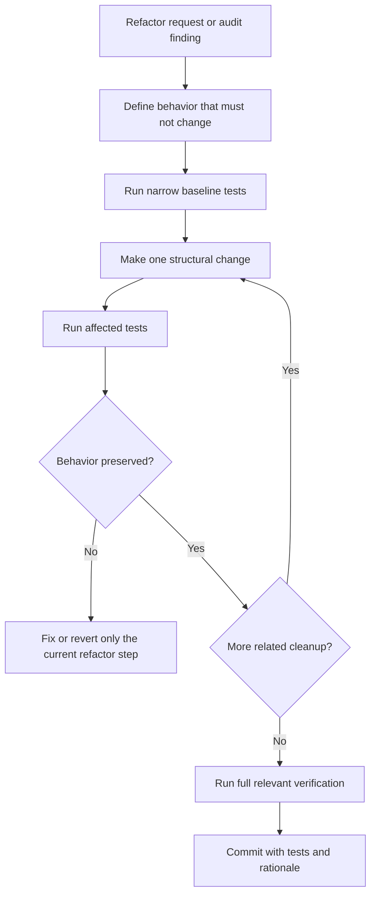

# Refactoring Governance

This document defines how SuperZip refactoring is planned, triggered, executed,
and verified without changing product behavior accidentally.

## References Checked

Checked on 2026-06-16:

- Martin Fowler, Refactoring: <https://refactoring.com/>
- Google Engineering Practices, Small CLs: <https://google.github.io/eng-practices/review/developer/small-cls.html>
- Microsoft Visual Studio refactoring documentation: <https://learn.microsoft.com/en-us/visualstudio/ide/refactoring-in-visual-studio>
- NIST Secure Software Development Framework SP 800-218: <https://csrc.nist.gov/pubs/sp/800/218/final>
- CISA Secure by Design: <https://www.cisa.gov/securebydesign>
- OWASP Secure Coding Practices Quick Reference Guide: <https://owasp.org/www-project-secure-coding-practices-quick-reference-guide/>
- GitHub Actions secure use: <https://docs.github.com/actions/security-guides/security-hardening-for-github-actions>
- OpenSSF Scorecard checks: <https://github.com/ossf/scorecard>
- SLSA specification v1.2: <https://slsa.dev/spec/v1.2/>
- Microsoft Security Development Lifecycle practices: <https://www.microsoft.com/en-us/securityengineering/sdl/practices>
- C++ Core Guidelines: <https://isocpp.github.io/CppCoreGuidelines/CppCoreGuidelines>
- SEI CERT C++ Coding Standard: <https://cmu-sei.github.io/secure-coding-standards/sei-cert-cpp-coding-standard/>

The common rule is that refactoring changes structure while preserving behavior.
For SuperZip, that means tests, benchmark baselines, and security gates are part
of the refactor itself, not a cleanup step after the fact.

## Modernization Baseline

Modernization work must improve the codebase through enforceable properties:
clear ownership, bounded resources, simpler dependency direction, smaller
functions, explicit contracts, stronger tests, and more accurate telemetry.
Do not perform vague repo-wide rewrites. A modernization commit must state the
behavior preserved, the invariant improved, and the verification that proved it.

## Trigger Policy

Refactoring may start in two ways:

- User-requested: a maintainer explicitly asks for cleanup, architecture work,
  readability work, or performance-neutral restructuring.
- Audit-triggered: `tools\refactor_audit.ps1` reports files or functions that
  cross the repo thresholds and the agent or maintainer decides the change is
  worth the risk.

Automatic audit-triggered refactoring must not silently land broad changes.
The automation produces findings and a plan; code edits still need tests and a
normal reviewable commit.

Changed code is held to a stricter gate than the historical backlog. The
repository still contains known large legacy surfaces, especially the native
Win32 UI shell, so the full audit remains a planning tool. New or modified
functions must pass the changed-code gate before push:

```powershell
tools\refactor_audit.ps1 -ChangedOnly -CheckContracts -MaxFunctionLines 120 -MaxComplexityMarkers 35 -FailOnFindings
```

This gate is intentionally wired into `tools\security_scan.ps1` so large or
poorly documented functions are caught locally before CodeQL reports them after
push. Do not bypass it with exclusions; split the changed function or add the
required function contract.

## Workflow


```mermaid
flowchart TD
    A["Refactor request or audit finding"] --> B["Define behavior that must not change"]
    B --> C["Run narrow baseline tests"]
    C --> D["Make one structural change"]
    D --> E["Run affected tests"]
    E --> F{"Behavior preserved?"}
    F -- "No" --> G["Fix or revert only the current refactor step"]
    F -- "Yes" --> H{"More related cleanup?"}
    H -- "Yes" --> D
    H -- "No" --> I["Run full relevant verification"]
    I --> J["Commit with tests and rationale"]
```

## Refactoring Rules

- Keep functional changes separate from structural cleanup unless one cannot be
  tested without the other.
- Prefer smaller commits and smaller pull requests.
- Preserve public CLI output unless the change explicitly updates a documented
  contract.
- Preserve archive compatibility, path-safety behavior, Defender opt-in
  behavior, and AMD HIP required-GPU failure behavior.
- Measure performance before and after when touching hot paths, worker
  allocation, memory buffers, or GPU codec code.
- Do not replace clear code with an abstraction unless it removes real
  duplication, narrows ownership, or improves testability.
- Do not chase novelty for its own sake. Prefer established C++20 idioms and
  repo-local architecture over experimental language/library features unless
  they remove a concrete risk and are supported by the Windows MSVC/HIP toolchain.
- Keep hot-path refactors allocation-aware and concurrency-aware. New queues,
  buffers, threads, async work, GPU transfers, or caches need explicit limits and
  before/after performance evidence.
- Do not normalize third-party code under `third_party/upstream`; production
  dependency patches belong under the patched copy only.

## Required Gates

Use the change-aware planner and runner for the complete intended change range:

```powershell
tools\verification_plan.ps1 -IncludeUntracked
tools\verify_changes.ps1 -IncludeUntracked
```

The planner selects native builds, affected component or full runtime coverage,
scanner preflight, language lint and the changed-function gate. Preserve its
required checks; a documentation or tooling change does not independently
justify rebuilding native targets. Use the operating guide's checkpoint
procedure for ongoing development and final acceptance.

GUI changes additionally require the announced all-page smoke and visual
inspection defined by the operating guide. Performance changes use the
affected mode's existing measurement protocol: the
[paired benchmark controller](performance-block-size-validation.md) for numeric
efforts, or the [public-corpus controller](neutron-public-corpus-benchmark.md)
for Neutron. A numeric level-five sweep or autotuning run cannot qualify a
Neutron-only refactor. Keep before/after source and workload identities,
independent byte-exact readback, complete archive sizes and actual HIP telemetry.
All development benchmark payloads remain RAM-only. Filesystem correctness
smoke follows the guide's separate bounded-write contract.

## Audit Tool

Run:

```powershell
tools\refactor_audit.ps1
```

The default audit reports large files, large functions, and selected complexity
markers. It does not modify files. Add `-CheckContracts` when auditing function
contract comments; that heuristic is intentionally opt-in because lambdas and
test macros can produce false positives. Use `-FailOnFindings` only in a
deliberate quality gate after existing findings have been triaged.
